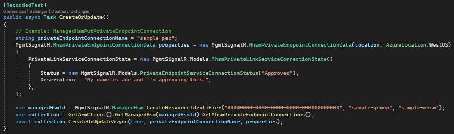
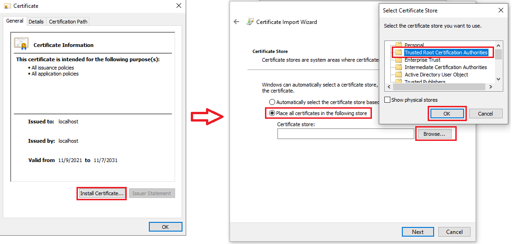
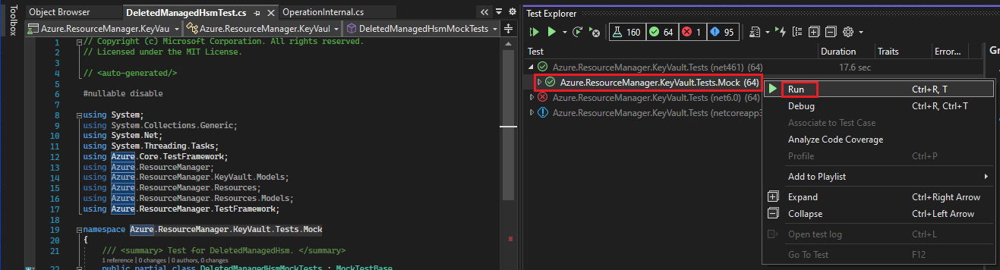
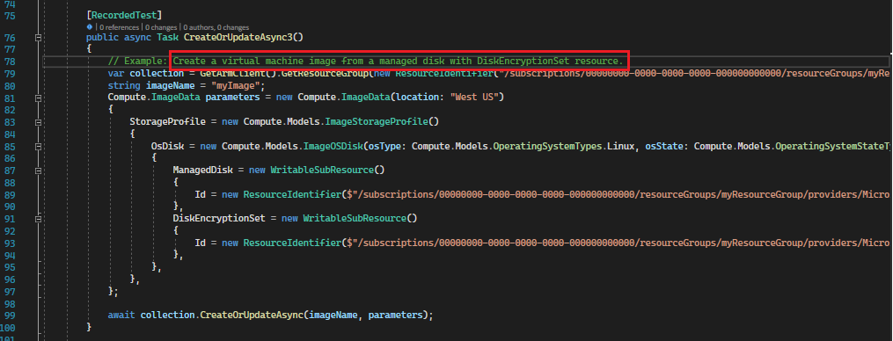

# Table of Contents
1. [Generate Mock Test](#generate-mock-test)
2. [Prepare the Mock-service-host](#prepare-mock-service-host)
3. [Execute Mock Test](#execute-mock-test)
4. [How to skip failure test](#skip-swagger-example)
4. [FAQ](#faq)

This article demonstrate how to generate and execute mock test for .Net SDK.

Writing and executing live tests for SDKs are difficult for some RPs:
+ Various Azure resources need to be created as prerequisites before testing the APIs in the RP itself.
+ Need to understand executing orders of APIs inside the RP.
+ Some APIs take long time to execute which make writing/debugging tests is time consuming.

In case we focused only on SDK behavior instead of service behavior, the mock test can be used to validate the SDK quality efficiently. The mock test can be generated and executed under the [mock-service-host](https://github.com/Azure/azure-sdk-tools/tree/main/tools/mock-service-host) to save developer's efforts.

Below is a sample for mock testcase:



<div id="generate-mock-test"/>

# Generate Mock Test
The Mgmt mock tests can be generated by below steps:

1. Go to folder Azure.ResourceManager.xxx\tests
    ~~~
    > cd Azure.ResourceManager.xxx\tests
    ~~~

2. Create Azure.ResourceManager.xxx.Tests.csproj file. Below is a test project template file:
    ~~~
    <Project Sdk="Microsoft.NET.Sdk">
      <ItemGroup>
        <ProjectReference Include="..\src\Azure.ResourceManager.xxx.csproj" />
        <PackageReference Include="Azure.Identity" />
      </ItemGroup>
    </Project>
    ~~~

3. Create file autorest.tests.md, the content are:
    ~~~
    # Generated test code configuration

    Run `dotnet build /t:GenerateTests` to generate test code.

    ``` yaml
    require:
      - ../src/autorest.md
    ```
    ~~~

4. Generate

    [USE autorest]
    ~~~
    // clone autorest.csharp and build
    > autorest --use=PATH_TO_AUTOREST.CSHARP\artifacts\bin\AutoRest.CSharp\Debug\net6.0 autorest.tests.md --testmodeler={} --debug
    ~~~

    [or USE dotnet target]

    ~~~
    > dotnet build /t:GenerateTests
    ~~~

    The generated results looks like below:
    ~~~
    D:.
    │   autorest.tests.md
    │   Azure.ResourceManager.KeyVault.Tests.csproj
    │
    ├───generated
    │   │
    │   └───Mock
    │           DeletedManagedHsmCollectionTest.cs
    │           DeletedManagedHsmTest.cs
    │           DeletedVaultCollectionTest.cs
    │           DeletedVaultTest.cs
    │           ManagedHsmCollectionTest.cs
    │           ManagedHsmTest.cs
    │           MhsmPrivateEndpointConnectionCollectionTest.cs
    │           MhsmPrivateEndpointConnectionTest.cs
    │           PrivateEndpointConnectionCollectionTest.cs
    │           PrivateEndpointConnectionTest.cs
    │           TestHelper.cs
    │           VaultCollectionTest.cs
    │           VaultTest.cs
    ~~~


<div id="prepare-mock-service-host"/>

# Launch the Mock-service-host
> **_NOTE:_** The mock-service-host use [OpenSSL Toolkit](https://www.openssl.org/) to create certificates for HTTPS channel. So make sure it's available in your computer.

The script Launch-MockServiceHost.ps1 can be used to launch the mock-service-host in one step.
For example:
~~~
// Powershell Administrator Mode:

// launch mock-service-host for all RPs (take about 3 minutes):
> pwsh eng\scripts\Launch-MockServiceHost.ps1

// launch mock-service-host for single RP (take several seconds):
> pwsh eng\scripts\Launch-MockServiceHost.ps1 -rpName keyvault
~~~

The mock-service-host is ready after 'validator initialized' is shown.
~~~
> @azure-tools/mock-service-host@0.1.8 start D:\projects\codegen\azure-sdk-tools\tools\mock-service-host
> tsc && node dist/src/main.js

Listening https on port: 8441
Listening http on port: 8442
Listening https on port: 8443
Listening https on port: 8445
2021-12-21T07:54:10.265Z [info]: SpecRetrieverFilesystem: Set spec cache path as ../../../azure-rest-api-specs
2021-12-21T07:54:10.267Z [info]: validator is initializing with options {
    "git": {
        "url": "https://github.com/Azure/azure-rest-api-specs",
        "shouldClone": false
    },
    "swaggerPathsPattern": [
        "specification/keyvault/resource-manager/**/*.json"
    ],
    "directory": "D:\\projects\\codegen\\azure-rest-api-specs",
    "isPathCaseSensitive": false
}
2021-12-21T07:54:10.809Z [info]: validator initialized
~~~
> **_NOTE:_** Refer to [README.md](https://github.com/Azure/azure-sdk-tools/tree/main/tools/mock-service-host) for more information about mock-service-host.


<div id="execute-mock-test"/>

# Execute Mock Test

## Trust the mock-service-host certificate '.ssh/localhost-ca.crt'
> **_NOTE:_** Don't need this step if once launched mock-service-host with Launch-MockServiceHost.ps1 in Administrator Mode.

The mock-service-host use a self-signed certificate to enable HTTPs channel, so need to trust the certificate before execute any mock test.
Once the mock-service-host is launched, the certificate will be created as 'mock-service-host/.ssh/localhost-ca.crt'. Double click the crt file and follow below to install it.



## Execute
Now you can execute the generated mock test like any others.
All mock tests are generated in namespace 'Azure.ResourceManager.xxx.Tests.Mock', below is an picture for executing mock test in visual studio test explorer.



> **_NOTE:_** Recording files will be generated after the executing, need to include the recording files if want to commit the generated test into the sdk repo.


<div id="skip-swagger-example"/>

# How to Skip swagger Example
The test may be failed for tooling or example issues. You can skip the test generation for specific examples with configuration 'testmodeler.mock.disabled-examples' in autorest.tests.md
~~~
testmodeler:
  mock:
    disabled-examples:
      - Create a virtual machine image from a managed disk with DiskEncryptionSet resource.
      - Create a virtual machine image from a managed disk.
~~~
The example names can be copied from the generated test function:



<div id="FAQ"/>

# FAQ

**Q1: Does mock-test require service API readiness?**

**A:** No. The mock test send request to local mock-service-host.


**Q2: Are swagger example files required to generate the mock test?**

**A:** Yes.


**Q3: In the mock testcase, do I need to create a resource before I test the delete API?**

**A:** No. The mock-service-host are stateless by default. Refer to [mock-service-host](https://github.com/Azure/azure-sdk-tools/tree/main/tools/mock-service-host) for more information.