# How `autorest.bicep` Recognizes ARM Resources

Reference notes derived from reading
[`Azure/bicep-types-az`](https://github.com/Azure/bicep-types-az), commit
`0ccebee8435576da4cedb11dbb05aa85d8b6e995`. All file links below pin to that
commit so the line numbers stay valid.

The whole resource-detection algorithm lives in one file:
[`src/autorest.bicep/src/resources.ts`](https://github.com/Azure/bicep-types-az/blob/0ccebee8435576da4cedb11dbb05aa85d8b6e995/src/autorest.bicep/src/resources.ts).

## High-level pipeline

`getProviderDefinitions(codeModel, host)` runs once per API version and
emits a `ProviderDefinition` per provider namespace. The algorithm is
purely **path-driven** — it does not look at TypeSpec-style decorators or
at any "is this a Resource model" marker on the input model classes. It
walks the AutoRest `CodeModel`, finds operations, classifies them by HTTP
verb, then turns each unique path into a resource descriptor.

Entry point:
[resources.ts:204](https://github.com/Azure/bicep-types-az/blob/0ccebee8435576da4cedb11dbb05aa85d8b6e995/src/autorest.bicep/src/resources.ts#L204).

Per-API-version pass:
[resources.ts:279](https://github.com/Azure/bicep-types-az/blob/0ccebee8435576da4cedb11dbb05aa85d8b6e995/src/autorest.bicep/src/resources.ts#L279).

## Step 1 — Bucketing operations by verb

Every operation is examined and, for each HTTP verb that interests bicep,
indexed into one of three maps keyed by lowercased path:

- `getOperationsByPath` — operations with a GET request.
- `putOperationsByPath` — operations with a PUT request.
- `postListOperationsByPath` — POST operations whose action name (the last
  path segment) starts with `list`.

See [resources.ts:283-365](https://github.com/Azure/bicep-types-az/blob/0ccebee8435576da4cedb11dbb05aa85d8b6e995/src/autorest.bicep/src/resources.ts#L283-L365).

DELETE, HEAD, PATCH, non-`list*` POST, etc. are **not tracked at all**.
Bicep cares about the existence of a writable surface (PUT), a readable
surface (GET), and `list*` actions (which become resource-bound list
functions in Bicep). Everything else is irrelevant to the schema.

### Parameter-validation gate

Before an operation is recorded, its parameters are checked by
`gatherParameterWarnings`
([resources.ts:244-277](https://github.com/Azure/bicep-types-az/blob/0ccebee8435576da4cedb11dbb05aa85d8b6e995/src/autorest.bicep/src/resources.ts#L244-L277)).
A required parameter is **only allowed** in:

- `path`, `body`, `uri`, `virtual`, or `none` (always allowed:
  [resources.ts:184-190](https://github.com/Azure/bicep-types-az/blob/0ccebee8435576da4cedb11dbb05aa85d8b6e995/src/autorest.bicep/src/resources.ts#L184-L190)),
- `header` if its serialized name is `content-type`, `accept`, `if-match`,
  or `if-none-match`,
- `query` if its serialized name is `api-version`.

Any other required parameter (e.g. a custom required header) disqualifies
the operation; a warning is emitted and the operation is **not** added to
its bucket. If a path's PUT is disqualified, the GET on that path may still
qualify it as a resource (and vice versa). If both are disqualified, the
path doesn't produce a resource at all.

## Step 2 — Deciding which paths are resources

For each path that appears in the union of `getOperationsByPath` and
`putOperationsByPath`
([resources.ts:368-389](https://github.com/Azure/bicep-types-az/blob/0ccebee8435576da4cedb11dbb05aa85d8b6e995/src/autorest.bicep/src/resources.ts#L368-L389)):

1. **PUT path → resource (writable).** If the path has a PUT, that PUT
   defines the resource. The request body is the payload schema. Whether or
   not a GET also exists determines `readableScopes`.
2. **GET path with `x-ms-azure-resource` response → resource (read-only).**
   If there is no PUT but the GET response schema (or any of its ancestor
   schemas) carries the OpenAPI extension `x-ms-azure-resource: true`, the
   path is a read-only resource. The check walks the schema parent chain:
   `isResourceSchema` →
   [resources.ts:240-242](https://github.com/Azure/bicep-types-az/blob/0ccebee8435576da4cedb11dbb05aa85d8b6e995/src/autorest.bicep/src/resources.ts#L240-L242);
   inheritance walk in
   [resources.ts:221-238](https://github.com/Azure/bicep-types-az/blob/0ccebee8435576da4cedb11dbb05aa85d8b6e995/src/autorest.bicep/src/resources.ts#L221-L238).
3. **Otherwise** the path is skipped with the comment "A non-resource get
   with no corresponding put is most likely a collection or utility
   endpoint."

So **PUT existence is the primary signal**. `x-ms-azure-resource` is only
consulted to rescue read-only resources that have no PUT.

Note: there is no separate notion of a "Resource model" with required
`id`/`name`/`type` properties driving the detection. The model class only
matters to populate the schema fields after a path has already been
classified as a resource.

### Body shape is irrelevant — `id`/`name`/`type`/`apiVersion` are synthesized

Even after a path is accepted, the PUT/GET body schema is **never inspected
to confirm it "looks like" an ARM resource**. In particular, the body does
not need to declare `id`, `name`, `type`, or `apiVersion`. The downstream
emitters always inject those four properties from the **path descriptor**:

- **`type-generator.ts`** (the default Bicep type output)
  [getStandardizedResourceProperties, type-generator.ts:271-280](https://github.com/Azure/bicep-types-az/blob/0ccebee8435576da4cedb11dbb05aa85d8b6e995/src/autorest.bicep/src/type-generator.ts#L271-L280)
  unconditionally produces:
  - `id` — read-only `string`
  - `name` — required, schema derived from the path's `{name}` parameter
  - `type` — string literal `Microsoft.Foo/widgets`
  - `apiVersion` — string literal of the API version
- These four are then merged with whatever the body declares, via
  [processResourceBody, type-generator.ts:118-161](https://github.com/Azure/bicep-types-az/blob/0ccebee8435576da4cedb11dbb05aa85d8b6e995/src/autorest.bicep/src/type-generator.ts#L118-L161).
  If the body declares one of those four names, the body's version is
  **dropped** and the synthesized one wins
  ([line 142-144](https://github.com/Azure/bicep-types-az/blob/0ccebee8435576da4cedb11dbb05aa85d8b6e995/src/autorest.bicep/src/type-generator.ts#L142-L144)).
- If the body schema is **missing entirely**, the resource is still emitted
  with just the four synthesized properties
  ([line 136-139](https://github.com/Azure/bicep-types-az/blob/0ccebee8435576da4cedb11dbb05aa85d8b6e995/src/autorest.bicep/src/type-generator.ts#L136-L139)).
- **`schema-generator.ts`** (the legacy ARM-JSON-schema output) does the
  same thing in a different shape:
  [line 385-413](https://github.com/Azure/bicep-types-az/blob/0ccebee8435576da4cedb11dbb05aa85d8b6e995/src/autorest.bicep/src/schema-generator.ts#L385-L413)
  synthesizes `name` from the path; `apiVersion` and `type` are then injected
  by [addResourceTypeAndApiVersion, schema-generator.ts:430-453](https://github.com/Azure/bicep-types-az/blob/0ccebee8435576da4cedb11dbb05aa85d8b6e995/src/autorest.bicep/src/schema-generator.ts#L430-L453).
  Body-declared `name` collisions are skipped at
  [line 401-403](https://github.com/Azure/bicep-types-az/blob/0ccebee8435576da4cedb11dbb05aa85d8b6e995/src/autorest.bicep/src/schema-generator.ts#L401-L403).
  (One asymmetry: `schema-generator.ts` bails for paths that have no PUT at
  [line 370-372](https://github.com/Azure/bicep-types-az/blob/0ccebee8435576da4cedb11dbb05aa85d8b6e995/src/autorest.bicep/src/schema-generator.ts#L370-L372),
  so read-only `x-ms-azure-resource` resources are not emitted as ARM
  JSON schemas — but `type-generator.ts` does emit them.)

The only way `processResource` skips a resource after detection is when
[`getNameType`](https://github.com/Azure/bicep-types-az/blob/0ccebee8435576da4cedb11dbb05aa85d8b6e995/src/autorest.bicep/src/type-generator.ts#L125-L128)
fails — and that itself depends on the **path's name segment**, not on the
body.

**Concrete consequence.** A PUT at
`/subscriptions/{}/providers/Microsoft.Foo/widgets/{name}` whose body is

```json
{ "color": "red", "size": 5 }
```

with no `id`/`name`/`type`/`properties` declared anywhere produces a fully
valid Bicep resource type:

```
Microsoft.Foo/widgets@<api-version>
  id         : string                            (read-only,  synthesized)
  name       : <schema of the {name} param>      (required,   synthesized)
  type       : 'Microsoft.Foo/widgets'           (read-only,  synthesized)
  apiVersion : '<api-version>'                   (read-only,  synthesized)
  color      : string                            (from body)
  size       : int                               (from body)
```

In other words: the **path** decides whether something is a resource and
what its `id`/`name`/`type`/`apiVersion` look like; the **body** only
contributes additional properties.

## Step 3 — Path validation

Once a path is classified as a resource, `parseResourceMethod` →
`parseResourceScopes` → `parseResourceDescriptors` →
`parseResourceTypes` validates and decomposes it.

`parseResourceScopes`
([resources.ts:604-618](https://github.com/Azure/bicep-types-az/blob/0ccebee8435576da4cedb11dbb05aa85d8b6e995/src/autorest.bicep/src/resources.ts#L604-L618)):

- The path **must** contain a `/providers/` segment. The last occurrence
  splits the path into `parentScope` (everything before, including
  `/providers/`) and `routingScope` (everything after).
- If no `/providers/` is found, the path is skipped with a warning.
- Special case: `/subscriptions/{}/resourceGroups/{}` is rewritten to
  `/subscriptions/{}/providers/Microsoft.Resources/resourceGroups/{}`
  before parsing
  ([resources.ts:108-115](https://github.com/Azure/bicep-types-az/blob/0ccebee8435576da4cedb11dbb05aa85d8b6e995/src/autorest.bicep/src/resources.ts#L108-L115)),
  so resource groups slot into the same model as every other resource.

`parseResourceDescriptors`
([resources.ts:620-651](https://github.com/Azure/bicep-types-az/blob/0ccebee8435576da4cedb11dbb05aa85d8b6e995/src/autorest.bicep/src/resources.ts#L620-L651)):

- The first segment of the routing scope is the **namespace**. If it is
  parameterized (`{nsName}`), the path is rejected.
- The trailing segment is the resource's name. If it is a literal, that
  literal becomes `descriptor.constantName` (the singleton/constant-name
  marker). If it is `{variable}`, the resource has a parameterized name.

`parseResourceTypes`
([resources.ts:694-734](https://github.com/Azure/bicep-types-az/blob/0ccebee8435576da4cedb11dbb05aa85d8b6e995/src/autorest.bicep/src/resources.ts#L694-L734)):

- After the namespace, segments must alternate
  `type1/name1/type2/name2/...`. The number of type segments and name
  segments must match (otherwise the path is rejected with "Found mismatch
  between type segments and name segments").
- Each `type` segment is normally a literal. If it is a parameterized
  `{variable}`, its parameter must be a `ChoiceSchema` /
  `SealedChoiceSchema` with at least one value; the path then **expands
  into one resource per enum value**, each substituted into that segment.

## Step 4 — Scope detection

`getScopeTypeFromParentScope`
([resources.ts:736-759](https://github.com/Azure/bicep-types-az/blob/0ccebee8435576da4cedb11dbb05aa85d8b6e995/src/autorest.bicep/src/resources.ts#L736-L759))
maps the `parentScope` (the part before the final `/providers/`) to a
`ScopeType`:

| `parentScope` regex | Scope |
| --- | --- |
| `^/$` | `Tenant` |
| `^/providers/Microsoft.Management/managementGroups/{\w+}/$` | `ManagementGroup` |
| `^/subscriptions/{\w+}/resourceGroups/{\w+}/$` | `ResourceGroup` |
| `^/subscriptions/{\w+}/$` | `Subscription` |
| Anything else still containing `/providers/` | `Extension` |
| Otherwise (ambiguous) | `All` |

Each resource ends up with a `readableScopes` and `writableScopes` field
populated according to whether the GET / PUT for that path qualified.

## Step 5 — `list*` POST actions

`postListOperationsByPath` is iterated separately
([resources.ts:426-460](https://github.com/Azure/bicep-types-az/blob/0ccebee8435576da4cedb11dbb05aa85d8b6e995/src/autorest.bicep/src/resources.ts#L426-L460)).
Each entry becomes a `ResourceListActionDefinition`:

- The action name is the last segment of the routing scope.
- The descriptor is the routing scope **minus** that last segment, so the
  action attaches to the resource type it hangs off.
- The action name is normalized so its `list` prefix is lowercase
  ([resources.ts:73-80](https://github.com/Azure/bicep-types-az/blob/0ccebee8435576da4cedb11dbb05aa85d8b6e995/src/autorest.bicep/src/resources.ts#L73-L80)).

So bicep's "actions" are exclusively `list*` POSTs. Other POSTs, custom
verbs, etc. are not modeled.

## Step 6 — Collapsing duplicates

After parsing, resources sharing the same fully-qualified type are merged:

- `collapseDefinitionScopes`
  ([resources.ts:761-783](https://github.com/Azure/bicep-types-az/blob/0ccebee8435576da4cedb11dbb05aa85d8b6e995/src/autorest.bicep/src/resources.ts#L761-L783)):
  resources with the same `constantName` are merged by **OR-ing**
  `readableScopes` and `writableScopes` bitfields, so a resource defined at
  multiple scopes ends up with a single descriptor whose scope flags cover
  all of them.
- `collapsePartiallyConstantNameResources`
  ([resources.ts:785-842](https://github.com/Azure/bicep-types-az/blob/0ccebee8435576da4cedb11dbb05aa85d8b6e995/src/autorest.bicep/src/resources.ts#L785-L842)):
  if a parent path has both a parameterized variant (e.g. `/foo/{name}`)
  and one or more constant variants (e.g. `/foo/default`), and they share
  comparable PUT request schemas and GET response schemas, the constant
  variants are folded into the parameterized one. Their scope bits are
  merged in. This handles the "mostly parameterized resource with a couple
  of well-known constant names" pattern.
- `collapseActions`
  ([resources.ts:851-855](https://github.com/Azure/bicep-types-az/blob/0ccebee8435576da4cedb11dbb05aa85d8b6e995/src/autorest.bicep/src/resources.ts#L851-L855)):
  for each resource type, deduplicates list actions by lowercased action
  name.

## Summary of the criteria

A path produces an ARM resource in `autorest.bicep` iff **all** of the
following hold:

1. The path contains `/providers/` (or is the special
   `/subscriptions/{}/resourceGroups/{}` form).
2. After `/providers/`, segments alternate `type/name/type/name/...` with
   the namespace segment being a literal.
3. Either:
   - a **PUT** operation on the path passes the parameter-validation gate,
     **or**
   - a **GET** operation on the path passes the parameter-validation gate
     and its response schema (or any ancestor) has the
     `x-ms-azure-resource: true` extension.
4. Any parameterized type segment in the path resolves to a closed enum
   parameter (otherwise the path is rejected).

Singleton-ness is not a separate concept: it is just "the trailing name
segment is a literal". Parent relationships are not annotated anywhere:
they are exactly the `type/{name}` nesting in the path. Scope is exactly
the `parentScope` regex match. The body schema never gates detection and
never determines the `id`/`name`/`type`/`apiVersion` of the resulting
resource — those are synthesized from the path. The resulting
`ProviderDefinition` is therefore a near-mechanical projection of the
spec's URLs.

This is the picture our TypeSpec-side resource detection should reproduce.

## End-to-end flow

```mermaid
flowchart TD
    A[AutoRest CodeModel] --> B[For each apiVersion]
    B --> C[For each operation]

    C --> D{Has GET request?}
    D -- yes --> D1{Required params<br/>only in path/body/uri/<br/>allowed header/query?}
    D1 -- yes --> D2[Index by lowercased path<br/>into getOperationsByPath]
    D1 -- no  --> D3[Warn and skip]

    C --> E{Has PUT request?}
    E -- yes --> E1{Required params<br/>only in path/body/uri/<br/>allowed header/query?}
    E1 -- yes --> E2[Index by lowercased path<br/>into putOperationsByPath]
    E1 -- no  --> E3[Warn and skip]

    C --> F{Has POST request?}
    F -- yes --> F1{Last path segment<br/>starts with 'list'?}
    F1 -- yes --> F2{Required params<br/>only in path/body/uri/<br/>allowed header/query?}
    F2 -- yes --> F3[Index by lowercased path<br/>into postListOperationsByPath]
    F2 -- no  --> F4[Warn and skip]
    F1 -- no  --> F5[Skip]

    D2 --> G[Resource path candidates =<br/>union of GET and PUT path keys]
    E2 --> G

    G --> H{For each path}
    H --> I{Path has PUT?}
    I -- yes --> J[Resource: writable<br/>schema = PUT body]
    I -- no  --> K{GET response or any ancestor<br/>has 'x-ms-azure-resource'?}
    K -- yes --> L[Resource: read-only<br/>schema = GET response]
    K -- no  --> M[Skip<br/>treat as collection/utility endpoint]

    J --> N[parseResourceMethod path]
    L --> N

    N --> O[Rewrite resourceGroups special case<br/>/subscriptions/&#123;&#125;/resourceGroups/&#123;&#125;<br/>to Microsoft.Resources/resourceGroups]
    O --> P[Split at last /providers/<br/>parentScope plus routingScope]
    P --> Q{routingScope segments<br/>match type/name/type/name/...<br/>and namespace is literal?}
    Q -- no  --> R[Warn and skip path]
    Q -- yes --> S{Any parameterized<br/>type segment?}
    S -- no  --> T[Single ResourceDescriptor]
    S -- yes --> U{Param schema is<br/>closed enum?}
    U -- no  --> R
    U -- yes --> V[Expand to one<br/>ResourceDescriptor per enum value]

    T --> W[Map parentScope to ScopeType<br/>Tenant / MgGroup / Subscription /<br/>ResourceGroup / Extension]
    V --> W
    W --> X[Group descriptors by namespace<br/>into ProviderDefinition.resourcesByType]

    F3 --> Y[For each list* POST]
    Y --> Z[parseResourceActionMethod<br/>actionName = last segment<br/>resource type = routingScope minus that segment]
    Z --> AA[Group by namespace<br/>into ProviderDefinition.resourceActions]

    X --> AB[collapseDefinitionScopes<br/>OR readableScopes/writableScopes<br/>per constantName]
    AB --> AC[collapsePartiallyConstantNameResources<br/>fold constant-name variants into the<br/>parameterized variant when schemas match]
    AA --> AD[collapseActions<br/>dedupe by lowercased actionName]

    AC --> AE[ProviderDefinition&#91;&#93; output]
    AD --> AE
```



The diagram is a faithful summary of the code path described in the
sections above; line numbers in those sections point at each box.
