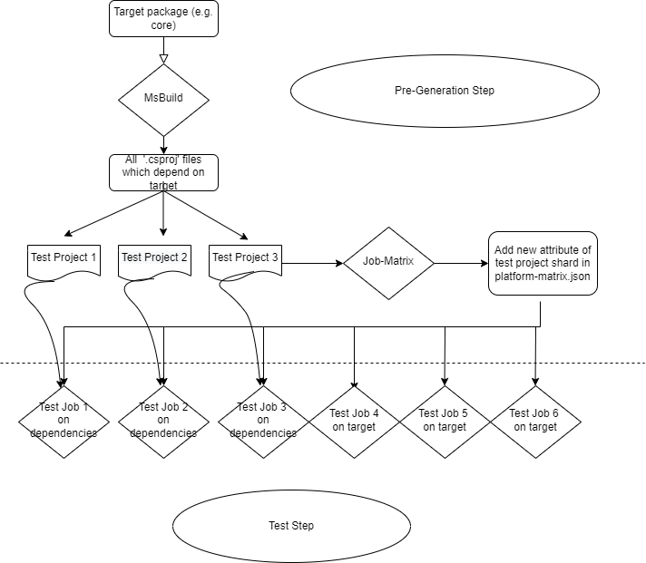

# Test dependency Splitting Strategy
## Problems
Today, most of the Azure service SDKs implemented in our repo have a dependency on the core library. In order to guarantee the changes on core do not break other SDKs depend on it, our core PR validation pipeline currently runs all tests under `sdk` folder. As the onboarding packages keep growing, the test steps of pipeline usually take nearly an hour to finish. We expect the PR validation to finish as fast as possible, which can unblock the changes checked in to the repo. This is the motivation of the test splitting task.

## Existing workflow
Before we run the tests, we have a step which determine all testing environments (OS image, pool, .NET framework etc.). For each of the testing environment, we check which service triggers the pipeline. If it is service other that core, then we run the tests under the service only. If it is core library, then we will run all tests under `sdk` folder. There are more than 400 packages in total, even we execute them in parallel, it still takes long while to get them done. 

## New workflow
Previously, it is not necessary to run everything under `sdk`, because we definitely have some packages which do not depend on core. So, for the new design, we add a target in msbuild project which will fetch all `.csproj` files depends on the target package. We introduce this flexibility of taking target package as parameter because not only core has the needs of testing its providers, but also other services (e.g. KeyVault, Storage etc.). By giving the number of tests we want to run on each test job, we evenly distributes the test project files into different chunks and write them into project files. Then we write these newly generated project files back to `platform-matrix.json` as new attribute of the test matrix. After the `PreGeneration` step, then the test step will know how many project files they will execute on. We can also control on the maximum tests on each test job.

Here is the workflow for better understanding:


## Enable/Disable the split work
We currently have this support in public PR validation pipeline and internal release pipeline.
We have enabled the core pipeline.

To enable the split on your service, you can add the line below in `ci.yml` under service repo. E.g. [ci.yml](https://github.com/Azure/azure-sdk-for-net/blob/main/sdk/core/ci.yml)
```
TestDependsOnDependency: ${service-name}
```
To disable, just remove the above line, and we will run the tests on target service only.

## Performance
Here is the comparison:
|     | Old | New |
| --- | --- | --- |
| Num of tests on each job | ~400 | ~20 |
| Time spent on core | ~ 1 hour as maximum | ~ 13 min as maximum | 

## Future work
1. Onboard to live test pipeline
1. Leverage the work on any time consuming job.