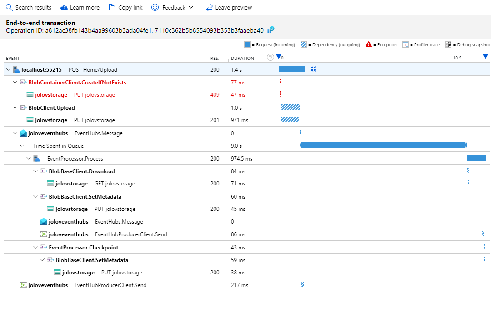

# LineCounter
This is a sample app that illustrates using Storage, Event Hubs, and Event Grid clients along with ASP.NET Core integration, distributed tracing and hosted services.
It allows users to upload a file to a blob, which triggers an Event Hubs event containing the file name. 
The Event Hubs Processor receives the event, and then the app downloads the blob and counts the number of lines in the file. The app displays a link to a page containing the line count. When the link is clicked, a CloudEvent containing the name of the file is published using Event Grid.

# Configuration

To run the sample set the following configuration properties using manage user secrets command in VS or user secrets command line https://docs.microsoft.com/aspnet/core/security/app-secrets?view=aspnetcore-2.2&tabs=windows#set-a-secret

``` json
{
  "Blob": {
    "connectionString": "..."
  },
  "Uploads": {
    "connectionString": "...",
    "eventHubName": "..."
  },
  "Results": {
    "connectionString": "...",
    "eventHubName": "..."
  },
  "Notification": {
    "endpoint": "...",
    "credential": {
      "key": "..."
  }
}
```

To light up App Insights, add the InstrumentationKey key and value to the ApplicationInsights node in appsettings.json

``` json
{
  "ApplicationInsights": {
    "InstrumentationKey": "..."
  }
}
```

# Azure Monitor
You can view an end-to-end transaction in the portal by going to your App. Click on the Search icon, and then click See all data.
After selecting a grouped result, you will be able to see a timeline of the grouped requests: .
