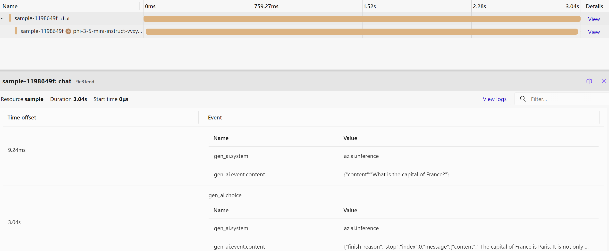

# Using telemetry with Azure.AI.Inference

In this example we will demonstrate how to enable [OpenTelemetry](https://opentelemetry.io/) to get observability into Chat Completions call.

## Project creation and dependency installation

First, we will create the console application project and add `Azure.AI.Inference` as a dependency. The first command will create the project called `TelemetryDemo.csproj`. The `dotnet add package <…>` command will modify project file and in future we will need to run `dotnet restore` to install all dependencies, if we will remove the installed ones.

```dotnetcli
dotnet new console --name TelemetryDemo --output TelemetryDemo
dotnet add package Azure.AI.Inference --prerelease
```

Now we will need to add the dependencies for OpenTelemetry exporters and HTTP client instrumentation.

```dotnetcli
dotnet add package OpenTelemetry.Exporter.Console
dotnet add package OpenTelemetry.Exporter.OpenTelemetryProtocol
dotnet add package OpenTelemetry.Instrumentation.Http
```

## Create the simple application with telemetry

The `dotnet new` created the project with the single file called Program.cs. Let us edit this file with the IDE of choice.

First we will import open telemetry and Azure.AI.Inference
```C# Snippet:Azure_AI_Inference_EnableOpenTelemetry_import
//Azure imports
// Open telemetry imports
using OpenTelemetry;
using OpenTelemetry.Resources;
using OpenTelemetry.Trace;
using OpenTelemetry.Metrics;
```

In this example we will configure OpenTelemetry to export distributed traces and metrics to console and local [OTLP](https://opentelemetry.io/docs/specs/otel/protocol/) endpoint such as [Aspire Dashboard](https://learn.microsoft.com/dotnet/aspire/fundamentals/dashboard/standalone).

Azure AI Inference reports distributed traces using [ActivitySources](https://learn.microsoft.com/dotnet/api/system.diagnostics.activitysource) and [Meters](https://learn.microsoft.com/dotnet/api/system.diagnostics.metrics.meter). We need to configure OpenTelemetry to listen to these sources.

Check out general [Azure SDK Diagnostics](https://github.com/Azure/azure-sdk-for-net/blob/main/sdk/core/Azure.Core/samples/Diagnostics.md) documentation for the details.

```C# Snippet:Azure_AI_Inference_EnableOpenTelemetry
// Enables experimental Azure SDK observability
AppContext.SetSwitch("Azure.Experimental.EnableActivitySource", true);

// By default instrumentation captures chat messages without content
// since content can be very verbose and have sensitive information.
// The following AppContext switch enables content recording.
AppContext.SetSwitch("Azure.Experimental.TraceGenAIMessageContent", true);

using var tracerProvider = Sdk.CreateTracerProviderBuilder()
    .AddHttpClientInstrumentation()
    .AddSource("Azure.AI.Inference.*")
    .ConfigureResource(r => r.AddService("sample"))
    .AddConsoleExporter()
    .AddOtlpExporter()
    .Build();

using var meterProvider = Sdk.CreateMeterProviderBuilder()
    .AddHttpClientInstrumentation()
    .AddMeter("Azure.AI.Inference.*")
    .ConfigureResource(r => r.AddService("sample"))
    .AddConsoleExporter()
    .AddOtlpExporter()
    .Build();
```

Now let's define the `endpoint`, `credential` and `model`.

```C# Snippet:Azure_AI_Inference_EnableOpenTelemetry_variables
var endpoint = new Uri(System.Environment.GetEnvironmentVariable("MODEL_ENDPOINT"));
var credential = new AzureKeyCredential(System.Environment.GetEnvironmentVariable("GITHUB_TOKEN"));
var model = System.Environment.GetEnvironmentVariable("MODEL_NAME");
```

Now we can create `ChatCompletionsClient` and make calls as usual - telemetry will be collected and exported without
any additional code.

```C# Snippet:Azure_AI_Inference_EnableOpenTelemetry_inference
var client = new ChatCompletionsClient(
    endpoint,
    credential,
    new AzureAIInferenceClientOptions());

var requestOptions = new ChatCompletionsOptions()
{
    Messages =
    {
        new ChatRequestSystemMessage("You are a helpful assistant."),
        new ChatRequestUserMessage("What is the capital of France?"),
    },
    Model = model,
    Temperature = 1,
    MaxTokens = 1000
};
// Call the endpoint and output the response.
Response<ChatCompletions> response = client.Complete(requestOptions);
Console.WriteLine(response.Value.Choices[0].Message.Content);
```

## Running the application

Optionally run the Aspire dashboard

```bash
docker run --rm -it \
    -p 18888:18888 \
    -p 4317:18889 -d \
    --name aspire-dashboard \
    mcr.microsoft.com/dotnet/aspire-dashboard:latest
```

Now run the application from IDE, or use
```dotnetcli
dotnet run
```

Check out telemetry in Aspire dashboard (at http://localhost:18888/traces):



## Next steps

After we have run the application, we can list all the metrics and events on the Application Insights. Please refer to the [documentation](https://learn.microsoft.com/azure/azure-monitor/app/opentelemetry-enable?tabs=aspnetcore). The events will be written to the table `traces`, metrics can be found in `customMetrics`.
