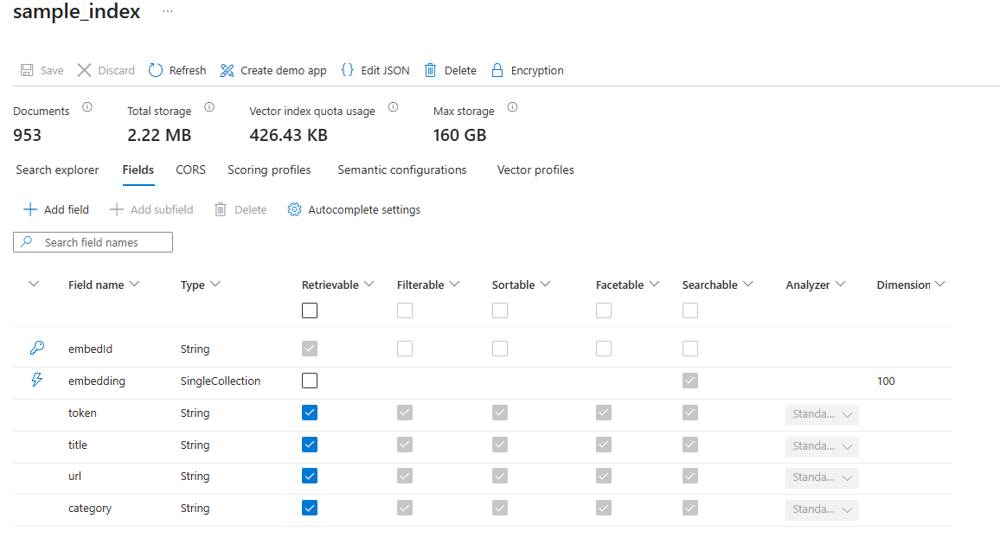

# Sample using Agents with Azure AI Search tool in Azure.AI.Projects.OpenAI.

Azure AI Search is an enterprise search system for high-performance applications.
It integrates with Azure OpenAI Service and Azure Machine Learning, offering advanced
search technologies like vector search and full-text search. Ideal for knowledge base
insights, information discovery, and automation. Creating an Agent with Azure AI
Search requires an existing Azure AI Search Index. For more information and setup
guides, see [Azure AI Search Tool Guide](https://learn.microsoft.com/azure/ai-services/agents/how-to/tools/azure-ai-search).

1. First, we need to read the environment variables, which will be used in the next steps.
```C# Snippet:Sample_CreateAgentClient_AzureAISearch
var projectEndpoint = System.Environment.GetEnvironmentVariable("PROJECT_ENDPOINT");
var modelDeploymentName = System.Environment.GetEnvironmentVariable("MODEL_DEPLOYMENT_NAME");
var aiSearchConnectionName = System.Environment.GetEnvironmentVariable("AI_SEARCH_CONNECTION_NAME");
AIProjectClient projectClient = new(endpoint: new Uri(projectEndpoint), tokenProvider: new DefaultAzureCredential());
```

2. Create an agent with `AzureAISearchAgentTool`. The `AzureAISearchAgentTool` constructor requires `AzureAISearchToolOptions`, which contain one or more `AzureAISearchToolIndex` objects. `AzureAISearchToolIndex` defines the index and the search parameters. `aiSearchConnectionName` variable is a name of the Azure AI Search connection ID as found in the "Connections" tab in your Microsoft Foundry project. In the Agent's instructions we explicitly ask it to return the citation.

Synchronous sample:
```C# Snippet:Sample_CreateAgent_AzureAISearch_Sync
AzureAISearchToolIndex index = new()
{
    ProjectConnectionId = aiSearchConnectionName,
    IndexName = "sample_index",
    TopK = 5,
    Filter = "category eq 'sleeping bag'",
    QueryType = AzureAISearchQueryType.Simple
};
PromptAgentDefinition agentDefinition = new(model: modelDeploymentName)
{
    Instructions = "You are a helpful assistant. You must always provide citations for answers using the tool and render them as: `\u3010message_idx:search_idx\u2020source\u3011`.",
    Tools = { new AzureAISearchTool(new AzureAISearchToolOptions(indexes: [index])) }
};
AgentVersion agentVersion = projectClient.Agents.CreateAgentVersion(
    agentName: "myAgent",
    options: new(agentDefinition));
```

Asynchronous sample:
```C# Snippet:Sample_CreateAgent_AzureAISearch_Async
AzureAISearchToolIndex index = new()
{
    ProjectConnectionId = aiSearchConnectionName,
    IndexName = "sample_index",
    TopK = 5,
    Filter = "category eq 'sleeping bag'",
    QueryType = AzureAISearchQueryType.Simple
};
PromptAgentDefinition agentDefinition = new(model: modelDeploymentName)
{
    Instructions = "You are a helpful assistant. You must always provide citations for answers using the tool and render them as: `\u3010message_idx:search_idx\u2020source\u3011`.",
    Tools = { new AzureAISearchTool(new AzureAISearchToolOptions(indexes: [index])) }
};
AgentVersion agentVersion = await projectClient.Agents.CreateAgentVersionAsync(
    agentName: "myAgent",
    options: new(agentDefinition));
```

3. Create a `ResponseResult` object.

Synchronous sample:
```C# Snippet:Sample_CreateResponse_AzureAISearch_Sync
ProjectResponsesClient responseClient = projectClient.OpenAI.GetProjectResponsesClientForAgent(agentVersion.Name);

ResponseResult response = responseClient.CreateResponse("What is the temperature rating of the cozynights sleeping bag?");
```

Asynchronous sample:
```C# Snippet:Sample_CreateResponse_AzureAISearch_Async
ProjectResponsesClient responseClient = projectClient.OpenAI.GetProjectResponsesClientForAgent(agentVersion.Name);

ResponseResult response = await responseClient.CreateResponseAsync("What is the temperature rating of the cozynights sleeping bag?");
```

4. In our search we have used an index containing "embedding", "token", "category", "title" and "url" fields as shown in the image.  The last two fields are needed to get citation title and url, retrieved by the agent. To get the reference we need to parse the output items. We will do it in the helper method `GetFormattedAnnotation`.

```C# Snippet:Sample_FormatReference_AzureAISearch
private static string GetFormattedAnnotation(ResponseResult response)
{
    foreach (ResponseItem item in response.OutputItems)
    {
        if (item is MessageResponseItem messageItem)
        {
            foreach (ResponseContentPart content in messageItem.Content)
            {
                foreach (ResponseMessageAnnotation annotation in content.OutputTextAnnotations)
                {
                    if (annotation is UriCitationMessageAnnotation uriAnnotation)
                    {
                        return $" [{uriAnnotation.Title}]({uriAnnotation.Uri})";
                    }
                }
            }
        }
    }
    return "";
}
```

5. Use the helper method to output the result.

```C# Snippet:Sample_WaitForResponse_AzureAISearch
Assert.That(response.Status, Is.EqualTo(ResponseStatus.Completed));
Console.WriteLine($"{response.GetOutputText()}{GetFormattedAnnotation(response)}");
```

6. Finally, delete all the resources we have created in this sample.

Synchronous sample:
```C# Snippet:Sample_Cleanup_AzureAISearch_Sync
projectClient.Agents.DeleteAgentVersion(agentName: agentVersion.Name, agentVersion: agentVersion.Version);
```

Asynchronous sample:
```C# Snippet:Sample_Cleanup_AzureAISearch_Async
await projectClient.Agents.DeleteAgentVersionAsync(agentName: agentVersion.Name, agentVersion: agentVersion.Version);
```
