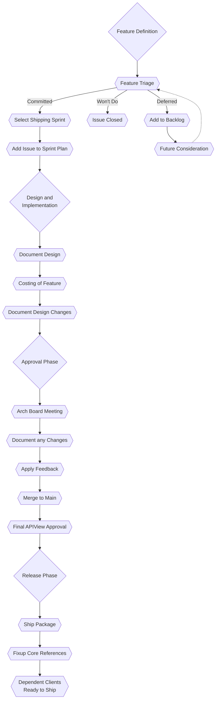

# Core Ship Sequence (draft)
Legend:
- diamond shapes == Phase
- hexagonal shapes == Sub Step

```mermaid
flowchart TD
    A{Feature Definition} --> B{{Feature Triage}}
    B -->|Committed| SelS{{Select Shipping Sprint}}
    SelS --> AtS{{Add Issue to Sprint Plan}}
    AtS --> DI{Design and<Br/> Implementation}
    DI --> DDes{{Document Design}}
    DDes --> Cost{{Costing of Feature}}
    Cost --> DDec{{Document Design Changes}}
    DDec --> AP{Approval Phase}
    AP --> Arch{{Arch Board Meeting}}
    Arch --> DocCh{{Document any Changes}}
    DocCh --> ApplyFB{{Apply Feedback}}
    ApplyFB --> Merge{{Merge to Main}}
    Merge --> FinalApp{{Final APIView Approval}}
    FinalApp --> RP{Release Phase}
    RP --> Ship{{Ship Package}}
    Ship --> Refs{{Fixup Core References}}
    Refs --> Clear{{Dependent Clients<Br/> Ready to Ship}}

    B -->|Won't Do| E{{Issue Closed}}

    B -->|Deferred| D{{Add to Backlog}}
    D --> FC{{Future Consideration}}
    FC -.-> B
```
