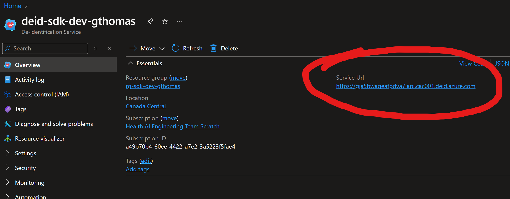

# Azure Health Data Services de-identification service client library for .NET
[][deid_nuget]

This package contains a client library for the de-identification service in Azure Health Data Services which
enables users to tag, redact, or surrogate health data containing Protected Health Information (PHI).
For more on service functionality and important usage considerations, see [the de-identification service overview][product_documentation].

[Source code](https://github.com/Azure/azure-sdk-for-net/blob/main/sdk/healthdataaiservices/Azure.Health.Deidentification/src) | [Package (NuGet)][deid_nuget] | [API reference documentation][docs] | [Product documentation][product_documentation] | [Samples][samples]

## Getting started

### Prerequisites

- Have an [Azure Subscription][azure_subscription].
- [Deploy the de-identification service][deid_quickstart].
- [Configure Azure role-based access control (RBAC)][deid_rbac] for the operations you will perform.

### Install the package

Install the .NET client library [NuGet package][deid_nuget]:

```dotnetcli
dotnet add package Azure.Health.Deidentification
```

### Authenticate the client

You will need a **service URL** to instantiate a client. You can find the service URL for a particular resource
in the [Azure portal][azure_portal]: 

You can also find the service URL with [Azure CLI][azure_cli]:
```bash
# Get the service URL for the resource
az deidservice show --name "<resource-name>" --resource-group "<resource-group-name>" --query "properties.serviceUrl"
```

The [Azure Identity][azure_identity] package provides the default implementation for authenticating the client.
You can use `DefaultAzureCredential` to automatically find the best credential to use at runtime.

```C# Snippet:AzHealthDeidSample1_DemonstrateCredential
const string serviceEndpoint = "https://example.api.cac001.deid.azure.com";
TokenCredential credential = new DefaultAzureCredential();
```
```C# Snippet:AzHealthDeidSample1_HelloWorld
DeidentificationClient client = new(
    new Uri(serviceEndpoint),
    credential,
    new DeidentificationClientOptions()
);
```

## Key concepts

### Operation Types
Given an input text, the de-identification service can perform three main operations:
- `Tag` returns the category and location within the text of detected PHI entities.
- `Redact` returns output text where detected PHI entities are replaced with placeholder text. For example `John` replaced with `[name]`.
- `Surrogate` returns output text where detected PHI entities are replaced with realistic replacement values. For example, `My name is John Smith` could become `My name is Tom Jones`.

For more information about customizing the redaction format, see [Tutorial: Use a custom redaction format with the de-identification service][deid_redaction_format].

### String Encoding
When using the `Tag` operation, the service will return the locations of PHI entities in the input text. These locations will be represented as offsets and lengths, each of which is a [StringIndex][string_index] containing
three properties corresponding to three different text encodings. **.NET applications should use the `Utf16` property.**

For more on text encoding, see [Character encoding in .NET][character_encoding].

### De-identification Methods
There are two methods of interacting with the de-identification service. You can send text directly, or you can create jobs
to de-identify documents in Azure Storage.

You can de-identify text directly using the `DeidentificationClient`:
```C# Snippet:AzHealthDeidSample1_CreateRequest
DeidentificationContent content = new("Hello, John!");

Response<DeidentificationResult> result = client.DeidentifyText(content);
string outputString = result.Value.OutputText;
Console.WriteLine(outputString); // Hello, Tom!
```

To de-identify documents in Azure Storage, you'll need a storage account with a container to which the
de-identification service has been granted an appropriate role. See [Tutorial: Configure Azure Storage to de-identify documents][deid_configure_storage]
for prerequisites and configuration options. You can upload the files in the [test data folder][test_data] as blobs, like: `https://<storageaccount>.blob.core.windows.net/<container>/example_patient_1/doctor_dictation.txt`.

You can create jobs to de-identify documents in the source Azure Storage account and container with an optional input prefix. If there's no input prefix, all blobs in the container will be de-identified. Azure Storage blobs can use `/` in the blob name to emulate a folder or directory layout. For more on blob naming, see [Naming and Referencing Containers, Blobs, and Metadata][blob_names]. The files you've uploaded can be de-identified by providing `example_patient_1` as the input prefix:
```
<container>/
├── example_patient_1/
       └──doctor_dictation.txt
       └──row-2-data.txt
       └──visit-summary.txt
```

Your target Azure Storage account and container where documents will be written can be the same as the source, or a different account or container. In the examples below, the source and target account and container are the same. You can specify an output prefix to indicate where the job's output documents should be written (defaulting to `_output`). Each document processed by the job will have the same relative blob name with the input prefix replaced by the output prefix:
```
<container>/
├── example_patient_1/
       └──doctor_dictation.txt
       └──row-2-data.txt
       └──visit-summary.txt
├── _output/
       └──doctor_dictation.txt
       └──row-2-data.txt
       └──visit-summary.txt
```

Create a job to de-identify documents:
```C# Snippet:AzHealthDeidSample2_CreateJob
DeidentificationJob job = new()
{
    SourceLocation = new SourceStorageLocation(new Uri(storageAccountUrl), "folder1/"),
    TargetLocation = new TargetStorageLocation(new Uri(storageAccountUrl), "output_folder1/"),
    OperationType = DeidentificationOperationType.Redact,
};

job = client.DeidentifyDocuments(WaitUntil.Started, "my-job-1", job).Value;
Console.WriteLine($"Job status: {job.Status}"); // Job status: NotStarted
```

### Thread safety

All client instance methods are thread-safe and independent of each other ([guideline](https://azure.github.io/azure-sdk/dotnet_introduction.html#dotnet-service-methods-thread-safety)). This ensures that the recommendation of reusing client instances is always safe, even across threads.

### Additional concepts
<!-- CLIENT COMMON BAR -->
[Client options](https://github.com/Azure/azure-sdk-for-net/blob/main/sdk/core/Azure.Core/README.md#configuring-service-clients-using-clientoptions) |
[Accessing the response](https://github.com/Azure/azure-sdk-for-net/blob/main/sdk/core/Azure.Core/README.md#accessing-http-response-details-using-responset) |
[Long-running operations](https://github.com/Azure/azure-sdk-for-net/blob/main/sdk/core/Azure.Core/README.md#consuming-long-running-operations-using-operationt) |
[Handling failures](https://github.com/Azure/azure-sdk-for-net/blob/main/sdk/core/Azure.Core/README.md#reporting-errors-requestfailedexception) |
[Diagnostics](https://github.com/Azure/azure-sdk-for-net/blob/main/sdk/core/Azure.Core/samples/Diagnostics.md) |
[Mocking](https://github.com/Azure/azure-sdk-for-net/blob/main/sdk/core/Azure.Core/README.md#mocking) |
[Client lifetime](https://devblogs.microsoft.com/azure-sdk/lifetime-management-and-thread-safety-guarantees-of-azure-sdk-net-clients/)
<!-- CLIENT COMMON BAR -->

## Examples

For sample code snippets illustrating common patterns used in the de-identification service, see the [samples][samples].

## Next steps

- Find a bug, or have feedback? Raise an issue with the [Health Deidentification][github_issue_label] label.

## Troubleshooting

- **Unable to Access Source or Target Storage**
  - Ensure you [assign a managed identity][deid_managed_identity] to your de-identification service
  - Ensure you [assign appropriate permissions][deid_rbac] to the managed identity to access the storage account

## Contributing

This project welcomes contributions and suggestions. Most contributions require
you to agree to a Contributor License Agreement (CLA) declaring that you have
the right to, and actually do, grant us the rights to use your contribution.
For details, visit https://cla.microsoft.com.

When you submit a pull request, a CLA-bot will automatically determine whether
you need to provide a CLA and decorate the PR appropriately (e.g., label,
comment). Simply follow the instructions provided by the bot. You will only
need to do this once across all repos using our CLA.

This project has adopted the
[Microsoft Open Source Code of Conduct][code_of_conduct]. For more information,
see the Code of Conduct FAQ or contact opencode@microsoft.com with any
additional questions or comments.

<!-- LINKS -->
[code_of_conduct]: https://opensource.microsoft.com/codeofconduct/
[product_documentation]: https://learn.microsoft.com/azure/healthcare-apis/deidentification/
[docs]: https://learn.microsoft.com/dotnet/api/azure.health.deidentification
[deid_nuget]: https://www.nuget.org/packages/Azure.Health.Deidentification
[string_index]: https://github.com/Azure/azure-sdk-for-net/blob/main/sdk/healthdataaiservices/Azure.Health.Deidentification/src/Generated/StringIndex.cs
[character_encoding]: https://learn.microsoft.com/dotnet/standard/base-types/character-encoding-introduction
[deid_redaction_format]: https://learn.microsoft.com/azure/healthcare-apis/deidentification/redaction-format
[azure_subscription]: https://azure.microsoft.com/free/
[deid_quickstart]: https://learn.microsoft.com/azure/healthcare-apis/deidentification/quickstart
[deid_rbac]: https://learn.microsoft.com/azure/healthcare-apis/deidentification/manage-access-rbac
[deid_managed_identity]: https://learn.microsoft.com/azure/healthcare-apis/deidentification/managed-identities
[deid_configure_storage]: https://learn.microsoft.com/azure/healthcare-apis/deidentification/configure-storage
[azure_identity]: https://learn.microsoft.com/dotnet/api/overview/azure/identity-readme
[azure_cli]: https://learn.microsoft.com/cli/azure/healthcareapis/deidservice?view=azure-cli-latest
[azure_portal]: https://ms.portal.azure.com
[github_issue_label]: https://github.com/Azure/azure-sdk-for-net/labels/Health%20Deidentification
[samples]: https://github.com/Azure/azure-sdk-for-net/tree/main/sdk/healthdataaiservices/Azure.Health.Deidentification/samples/README.md
[blob_names]: https://learn.microsoft.com/rest/api/storageservices/naming-and-referencing-containers--blobs--and-metadata#blob-names
[test_data]: https://github.com/Azure/azure-sdk-for-python/tree/main/sdk/healthdataaiservices/azure-health-deidentification/tests/data
