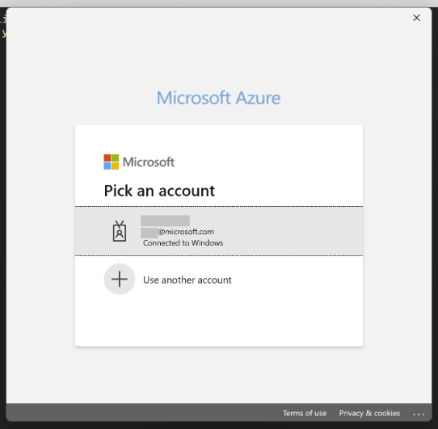
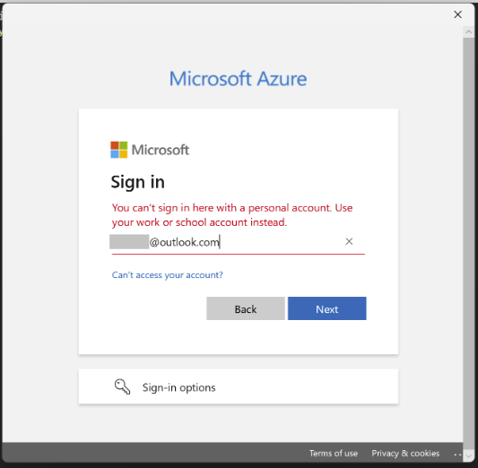
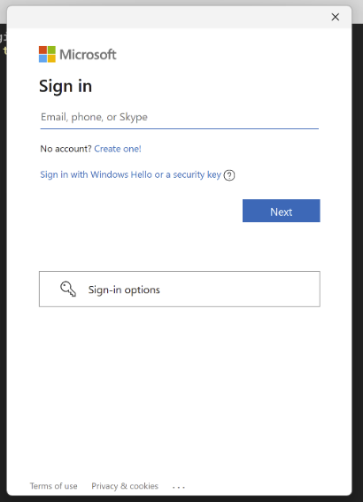

# Troubleshoot Azure Identity authentication issues

This troubleshooting guide covers failure investigation techniques, common errors for the credential types in the Azure Identity library for .NET, and mitigation steps to resolve these errors.

## Table of contents

- [Handle Azure Identity exceptions](#handle-azure-identity-exceptions)
  - [AuthenticationFailedException](#authenticationfailedexception)
  - [CredentialUnavailableException](#credentialunavailableexception)
  - [Permission issues](#permission-issues)
- [Find relevant information in exception messages](#find-relevant-information-in-exception-messages)
- [Enable and configure logging](#enable-and-configure-logging)
- [Troubleshoot DefaultAzureCredential authentication issues](#troubleshoot-defaultazurecredential-authentication-issues)
- [Troubleshoot EnvironmentCredential authentication issues](#troubleshoot-environmentcredential-authentication-issues)
- [Troubleshoot ClientSecretCredential authentication issues](#troubleshoot-clientsecretcredential-authentication-issues)
- [Troubleshoot ClientCertificateCredential authentication issues](#troubleshoot-clientcertificatecredential-authentication-issues)
- [Troubleshoot ClientAssertionCredential authentication issues](#troubleshoot-clientassertioncredential-authentication-issues)
- [Troubleshoot WorkloadIdentityCredential authentication issues](#troubleshoot-workloadidentitycredential-authentication-issues)
- [Troubleshoot ManagedIdentityCredential authentication issues](#troubleshoot-managedidentitycredential-authentication-issues)
  - [Azure Virtual Machine managed identity](#azure-virtual-machine-managed-identity)
  - [Azure App Service and Azure Functions managed identity](#azure-app-service-and-azure-functions-managed-identity)
- [Troubleshoot VisualStudioCredential authentication issues](#troubleshoot-visualstudiocredential-authentication-issues)
- [Troubleshoot VisualStudioCodeCredential authentication issues](#troubleshoot-visualstudiocodecredential-authentication-issues)
- [Troubleshoot AzureDeveloperCliCredential authentication issues](#troubleshoot-azuredeveloperclicredential-authentication-issues)
- [Troubleshoot AzureCliCredential authentication issues](#troubleshoot-azureclicredential-authentication-issues)
- [Troubleshoot AzurePowerShellCredential authentication issues](#troubleshoot-azurepowershellcredential-authentication-issues)
- [Troubleshoot multi-tenant authentication issues](#troubleshoot-multi-tenant-authentication-issues)
- [Troubleshoot brokered authentication issues](#troubleshoot-brokered-authentication-issues)
- [Troubleshoot AzurePipelinesCredential authentication issues](#troubleshoot-azurepipelinescredential-authentication-issues)
- [Get additional help](#get-additional-help)

## Handle Azure Identity exceptions

### AuthenticationFailedException

Exceptions arising from authentication errors can be raised on any service client method that makes a request to the service. This is because the token is requested from the credential on:

- The first call to the service.
- Any subsequent requests to the service that need to refresh the token.

To distinguish these failures from failures in the service client, Azure Identity classes raise the `AuthenticationFailedException` with details describing the source of the error in the exception message and possibly the error message. Depending on the application, these errors may or may not be recoverable.

```c#
using Azure.Identity;
using Azure.Security.KeyVault.Secrets;

// Create a secret client using the DefaultAzureCredential
var client = new SecretClient(new Uri("https://myvault.vault.azure.net/"), new DefaultAzureCredential());

try
{
    KeyVaultSecret secret = await client.GetSecretAsync("secret1");
}
catch (AuthenticationFailedException e)
{
    Console.WriteLine($"Authentication Failed. {e.Message}");
}
```

### CredentialUnavailableException

The `CredentialUnavailableException` is a special exception type derived from `AuthenticationFailedException`. This exception type is used to indicate that the credential can't authenticate in the current environment, due to lack of required configuration or setup. This exception is also used as a signal to chained credential types, such as `DefaultAzureCredential` and `ChainedTokenCredential`, that the chained credential should continue to try other credential types later in the chain.

### Permission issues

Calls to service clients resulting in `RequestFailedException` with a `StatusCode` of 401 or 403 often indicate the caller doesn't have sufficient permissions for the specified API. Check the service documentation to determine which RBAC roles are needed for the specific request, and ensure the authenticated user or service principal have been granted the appropriate roles on the resource.

## Find relevant information in exception messages

`AuthenticationFailedException` is thrown when unexpected errors occurred while a credential is authenticating. This can include errors received from requests to the Microsoft Entra STS and often contains information helpful to diagnosis. Consider the following `AuthenticationFailedException` message.


This error contains several pieces of information:

- __Failing Credential Type__: The type of credential that failed to authenticate. This can be helpful when diagnosing issues with chained credential types such as `DefaultAzureCredential` or `ChainedTokenCredential`.

- __STS Error Code and Message__: The error code and message returned from the Microsoft Entra STS. This can give insight into the specific reason the request failed. For instance, in this specific case because the provided client secret is incorrect. More information on STS error codes can be found [here](https://learn.microsoft.com/entra/identity-platform/reference-error-codes#aadsts-error-codes).

- __Correlation ID and Timestamp__: The correlation ID and call Timestamp used to identify the request in server-side logs. This information can be useful to support engineers when diagnosing unexpected STS failures.

### Enable and configure logging

The Azure Identity library provides the same [logging capabilities](https://github.com/Azure/azure-sdk-for-net/blob/main/sdk/core/Azure.Core/samples/Diagnostics.md#logging) as the rest of the Azure SDK.

The simplest way to see the logs to help debug authentication issues is to enable the console logger.

```c#
// Set up a listener to monitor logged events.
using AzureEventSourceListener listener = AzureEventSourceListener.CreateConsoleLogger();
```

All credentials can be configured with diagnostic options, in the same way as other clients in the SDK.

```c#
DefaultAzureCredentialOptions options = new
{
    Diagnostics =
    {
        LoggedHeaderNames = { "x-ms-request-id" },
        LoggedQueryParameters = { "api-version" },
        IsLoggingContentEnabled = true
    }
};
```

> CAUTION: Requests and responses in the Azure Identity library contain sensitive information. Precaution must be taken to protect logs when customizing the output to avoid compromising account security.

When troubleshooting authentication issues, you may also want to enable logging of sensitive information. To enable this type of logging, set the `IsLoggingContentEnabled` property to `true`. To only log details about the account that was used to attempt authentication and authorization, set the `IsAccountIdentifierLoggingEnabled` property to `true`:

```c#
DefaultAzureCredentialOptions options = new
{
    Diagnostics =
    {
        LoggedHeaderNames = { "x-ms-request-id" },
        LoggedQueryParameters = { "api-version" },
        IsAccountIdentifierLoggingEnabled = true
    }
};
```

## Troubleshoot `DefaultAzureCredential` authentication issues

| Error |Description| Mitigation |
|---|---|---|
|`CredentialUnavailableException` raised with message. "DefaultAzureCredential failed to retrieve a token from the included credentials."|All credentials in the `DefaultAzureCredential` chain failed to retrieve a token, each throwing a `CredentialUnavailableException`.|<ul><li>[Enable logging](#enable-and-configure-logging) to verify the credentials being tried, and get further diagnostic information.</li><li>Consult the troubleshooting guide for underlying credential types for more information.</li><ul><li>[EnvironmentCredential](#troubleshoot-environmentcredential-authentication-issues)</li><li>[WorkloadIdentityCredential](#troubleshoot-workloadidentitycredential-authentication-issues)</li><li>[ManagedIdentityCredential](#troubleshoot-managedidentitycredential-authentication-issues)</li><li>[VisualStudioCredential](#troubleshoot-visualstudiocredential-authentication-issues)</li><li>[AzureCliCredential](#troubleshoot-azureclicredential-authentication-issues)</li><li>[AzurePowerShellCredential](#troubleshoot-azurepowershellcredential-authentication-issues)</li></ul>|
|`RequestFailedException` raised from the client with a status code of 401 or 403|Authentication succeeded but the authorizing Azure service responded with a 401 (Authenticate) or 403 (Forbidden) status code. This error can often be caused by the `DefaultAzureCredential` authenticating an account other than the intended or that the intended account doesn't have the correct permissions or roles assigned.|<ul><li>[Enable logging](#enable-and-configure-logging) to determine which credential in the chain returned the authenticating token.</li><li>In the case a credential other than the expected is returning a token, bypass this by either signing out of the corresponding development tool, or excluding the credential with the ExcludeXXXCredential property in the `DefaultAzureCredentialOptions`</li><li>Ensure that the correct role is assigned to the account being used. For example, a service specific role rather than the subscription Owner role.</li></ul>|
|`ArgumentException` raised when calling `DefaultAzureCredential(string configurationEnvironmentVariableName, ...)`|The `configurationEnvironmentVariableName` parameter was null or empty.|Provide a valid environment variable name. The parameter cannot be null or empty.|
|`ArgumentException` raised with message: "Invalid environment variable name: '...' Only letters, digits, and underscores are allowed."|The `configurationEnvironmentVariableName` parameter contains invalid characters.|Ensure the environment variable name contains only letters, digits, and underscores. Special characters, spaces, and other symbols are not allowed.|
|`InvalidOperationException` raised with message: "Environment variable '...' is not set or is empty."|The specified custom environment variable is not set or contains an empty value.|Set the specified environment variable to a valid credential configuration value before starting the application.|
|`InvalidOperationException` raised with message: "Invalid value for environment variable AZURE_TOKEN_CREDENTIALS ..." | An invalid value was set for the AZURE_TOKEN_CREDENTIALS environment variable | Set the environment variable to one of the following values: dev, prod, `VisualStudioCredential`, `VisualStudioCodeCredential`, `AzureCliCredential`, `AzurePowerShellCredential`, `AzureDeveloperCliCredential`, `EnvironmentCredential`, `WorkloadIdentityCredential`, `ManagedIdentityCredential`, `InteractiveBrowserCredential`, or `BrokerCredential`. **Note:** `BrokerCredential` require that the project include a reference to package Azure.Identity.Broker. |

## Troubleshoot `EnvironmentCredential` authentication issues

`CredentialUnavailableException`

| Error Message |Description| Mitigation |
|---|---|---|
|Environment variables aren't fully configured.|A valid combination of environment variables wasn't set.|Ensure the appropriate environment variables are set **prior to application startup** for the intended authentication method.</p><ul><li>To authenticate a service principal using a client secret, ensure the variables `AZURE_CLIENT_ID`, `AZURE_TENANT_ID` and `AZURE_CLIENT_SECRET` are properly set.</li><li>To authenticate a service principal using a certificate, ensure the variables `AZURE_CLIENT_ID`, `AZURE_TENANT_ID`, `AZURE_CLIENT_CERTIFICATE_PATH`, and optionally `AZURE_CLIENT_CERTIFICATE_PASSWORD` are properly set.</li><li>To authenticate a user using a password, ensure the variables `AZURE_USERNAME` and `AZURE_PASSWORD` are properly set.</li><ul>|
|Password protection for PEM encoded certificates is not supported.|`AZURE_CLIENT_CERTIFICATE_PASSWORD` was set when using a PEM encoded certificate.|Re-encode the client certificate to a password protected PFX (PKCS12) certificate, or a PEM certificate without password protection.|

## Troubleshoot `ClientSecretCredential` authentication issues

`AuthenticationFailedException`

| Error Code | Issue | Mitigation |
|---|---|---|
|AADSTS7000215|An invalid client secret was provided.|Ensure the `clientSecret` provided when constructing the credential is valid. If unsure, create a new client secret using the Azure portal. Details on creating a new client secret can be found [here](https://learn.microsoft.com/entra/identity-platform/howto-create-service-principal-portal#option-3-create-a-new-client-secret).|
|AADSTS7000222|An expired client secret was provided.|Create a new client secret using the Azure portal. Details on creating a new client secret can be found [here](https://learn.microsoft.com/entra/identity-platform/howto-create-service-principal-portal#option-3-create-a-new-client-secret).|
|AADSTS700016|The specified application wasn't found in the specified tenant.|Ensure the specified `clientId` and `tenantId` are correct for your application registration. For multi-tenant apps, ensure the application has been added to the desired tenant by a tenant admin. To add a new application in the desired tenant, follow the instructions [here](https://learn.microsoft.com/entra/identity-platform/howto-create-service-principal-portal).|

## Troubleshoot `ClientCertificateCredential` authentication issues

`AuthenticationFailedException`

| Error Code | Description | Mitigation |
|---|---|---|
|AADSTS700027|Client assertion contains an invalid signature.|Ensure the specified certificate has been uploaded to the Microsoft Entra application registration. Instructions for uploading certificates to the application registration can be found [here](https://learn.microsoft.com/entra/identity-platform/howto-create-service-principal-portal#option-1-recommended-upload-a-trusted-certificate-issued-by-a-certificate-authority).|
|AADSTS700016|The specified application wasn't found in the specified tenant.| Ensure the specified `clientId` and `tenantId` are correct for your application registration. For multi-tenant apps, ensure the application has been added to the desired tenant by a tenant admin. To add a new application in the desired tenant, follow the instructions [here](https://learn.microsoft.com/entra/identity-platform/howto-create-service-principal-portal).

## Troubleshoot `ClientAssertionCredential` authentication issues

`AuthenticationFailedException`

| Error Code | Description | Mitigation |
|---|---|---|
|AADSTS700021| Client assertion application identifier doesn't match 'client_id' parameter. Review the documentation at [Microsoft Identity platform application authentication certificate credentials](https://learn.microsoft.com/entra/identity-platform/certificate-credentials). | Ensure the JWT assertion created has the correct values specified for the `sub` and `issuer` value of the payload, both of these should have the value be equal to `clientId`. Refer to the documentation for [client assertion format](https://learn.microsoft.com/entra/identity-platform/certificate-credentials).|
|AADSTS700023| Client assertion audience claim doesn't match Realm issuer. Review the documentation at [Microsoft Identity platform application authentication certificate credentials](https://learn.microsoft.com/entra/identity-platform/certificate-credentials). | Ensure the audience `aud` field in the JWT assertion created has the correct value for the audience specified in the payload. This should be set to `https://login.microsoftonline.com/{tenantId}/v2`.|
|AADSTS50027| JWT token is invalid or malformed. | Ensure the JWT assertion token is in the valid format. Refer to the documentation for [client assertion format](https://learn.microsoft.com/entra/identity-platform/certificate-credentials).|

## Troubleshoot `WorkloadIdentityCredential` authentication issues

`CredentialUnavailableException`

| Error Message |Description| Mitigation |
|---|---|---|
|`CredentialUnavailableException` raised with message. "WorkloadIdentityCredential authentication unavailable. The workload options are not fully configured."|The `WorkloadIdentityCredential` requires `ClientId`, `TenantId` and `TokenFilePath` to authenticate with Microsoft Entra ID.| <ul><li>If using `DefaultAzureCredential` then:</li><ul><li>Ensure client ID is specified via `WorkloadIdentityClientId` property on `DefaultAzureCredentialOptions` or `AZURE_CLIENT_ID` env variable.</li><li>Ensure tenant ID is specified via `AZURE_TENANT_ID` env variable.</li><li>Ensure token file path is specified via `AZURE_FEDERATED_TOKEN_FILE` env variable.</li><li>Ensure authority host is specified via `AZURE_AUTHORITY_HOST` env variable.</ul><li>If using `WorkloadIdentityCredential` then:</li><ul><li>Ensure tenant ID is specified via the `TenantId` property on the `WorkloadIdentityCredentialOptions` or `AZURE_TENANT_ID` env variable.</li><li>Ensure client ID is specified via the `ClientId` property on the `WorkloadIdentityCredentialOptions` or `AZURE_CLIENT_ID` env variable.</li><li>Ensure token file path is specified via the `TokenFilePath` property on the `WorkloadIdentityCredentialOptions` instance or `AZURE_FEDERATED_TOKEN_FILE` environment variable. </li></ul></li><li>Consult the [product troubleshooting guide](https://azure.github.io/azure-workload-identity/docs/troubleshooting.html) for other issues.</li></ul>
|The workload options are not fully configured.|The workload identity configuration wasn't provided in environment variables or through `WorkloadIdentityCredentialOptions`.|Ensure the appropriate environment variables are set **prior to application startup** or are specified in code.</p><ul><li>To configure the `WorkloadIdentityCredential` via the environment, ensure the variables `AZURE_AUTHORITY_HOST`, `AZURE_CLIENT_ID`, `AZURE_TENANT_ID`, and `AZURE_FEDERATED_TOKEN_FILE` are set by the admission webhook.</li><li>To configure the `WorkloadIdentityCredential` in code, ensure `ClientId`, `TenantId`, and `TokenFilePath` are set on the `WorkloadIdentityCredentialOptions` passed to the `WorkloadIdentityCredential` constructor.</li><ul>|

## Troubleshoot `ManagedIdentityCredential` authentication issues

The `ManagedIdentityCredential` is designed to work on various Azure hosts that provide managed identity. Configuring the managed identity and troubleshooting failures varies from hosts. The following table lists the Azure hosts that can be assigned a managed identity and are supported by the `ManagedIdentityCredential`.

|Host Environment| | |
|---|---|---|
|Azure App Service and Azure Functions|[Configuration](https://learn.microsoft.com/azure/app-service/overview-managed-identity)|[Troubleshooting](#azure-app-service-and-azure-functions-managed-identity)|
|Azure Arc|[Configuration](https://learn.microsoft.com/azure/azure-arc/servers/managed-identity-authentication)||
|Azure Service Fabric|[Configuration](https://learn.microsoft.com/azure/service-fabric/concepts-managed-identity)||
|Azure Virtual Machines and Scale Sets|[Configuration](https://learn.microsoft.com/entra/identity/managed-identities-azure-resources/qs-configure-portal-windows-vm)|[Troubleshooting](#azure-virtual-machine-managed-identity)|

### Azure Virtual Machine managed identity

`CredentialUnavailableException`

| Error Message |Description| Mitigation |
|---|---|---|
|The requested identity hasn't been assigned to this resource.|The IMDS endpoint responded with a status code of 400, indicating the requested identity isn't assigned to the VM.|If using a user assigned identity, ensure the specified `clientId` is correct.<p/><p/>If using a system assigned identity, make sure it has been enabled properly. Instructions to enable the system assigned identity on an Azure VM can be found [here](https://learn.microsoft.com/entra/identity/managed-identities-azure-resources/qs-configure-portal-windows-vm#enable-system-assigned-managed-identity-on-an-existing-vm).|
|The request failed due to a gateway error.|The request to the IMDS endpoint failed due to a gateway error, 502 or 504 status code.|IMDS doesn't support calls via proxy or gateway. Disable proxies or gateways running on the VM for calls to the IMDS endpoint `http://169.254.169.254/`|
|No response received from the managed identity endpoint.|No response was received for the request to IMDS or the request timed out.|<ul><li>Ensure managed identity has been properly configured on the VM. Instructions for configuring the managed identity can be found [here](https://learn.microsoft.com/entra/identity/managed-identities-azure-resources/qs-configure-portal-windows-vm).</li><li>Verify the IMDS endpoint is reachable on the VM by following the instructions at [Verify IMDS is available on the VM](#verify-imds-is-available-on-the-vm).</li></ul>|
|Multiple attempts failed to obtain a token from the managed identity endpoint.|Retries to retrieve a token from the IMDS endpoint have been exhausted.|<ul><li>For more information on specific failures, see the inner exception messages. If the data has been truncated, more detail can be obtained by [collecting logs](https://github.com/Azure/azure-sdk-for-net/tree/main/sdk/identity/Azure.Identity#logging).</li><li>Ensure managed identity has been properly configured on the VM. Instructions for configuring the managed identity can be found [here](https://learn.microsoft.com/entra/identity/managed-identities-azure-resources/qs-configure-portal-windows-vm).</li><li>Verify the IMDS endpoint is reachable on the VM by following the instructions at [Verify IMDS is available on the VM](#verify-imds-is-available-on-the-vm).</li></ul>|

#### __Verify IMDS is available on the VM__

If you have access to the VM, you can verify the managed identity endpoint is available via the command line using curl.

```bash
curl 'http://169.254.169.254/metadata/identity/oauth2/token?resource=https://management.core.windows.net&api-version=2018-02-01' -H "Metadata: true"
```

> Note that output of this command will contain a valid access token, and SHOULD NOT BE SHARED to avoid compromising account security.

### Azure App Service and Azure Functions Managed Identity

`CredentialUnavailableException`

| Error Message |Description| Mitigation |
|---|---|---|
|ManagedIdentityCredential authentication unavailable.|The environment variables configured by the App Services host weren't present.|<ul><li>Ensure the managed identity has been properly configured on the App Service. Instructions for configuring the managed identity can be found [here](https://learn.microsoft.com/azure/app-service/overview-managed-identity?tabs=dotnet).</li><li>Verify the App Service environment is properly configured and the managed identity endpoint is available by following the instructions at [Verify the App Service managed identity endpoint is available](#verify-the-app-service-managed-identity-endpoint-is-available).</li></ul>|

#### __Verify the App Service managed identity endpoint is available__

If you have access to SSH into the App Service, you can verify managed identity is available in the environment. First ensure the environment variables `MSI_ENDPOINT` and `MSI_SECRET` have been set in the environment. Then you can verify the managed identity endpoint is available using curl.

```bash
curl 'http://169.254.169.254/metadata/identity/oauth2/token?resource=https://management.core.windows.net&api-version=2018-02-01' -H "Metadata: true"
```

> Note that the output of this command will contain a valid access token, and SHOULD NOT BE SHARED to avoid compromising account security.

## Troubleshoot `VisualStudioCredential` authentication issues

`CredentialUnavailableException`

| Error Message |Description| Mitigation |
|---|---|---|
|Failed To Read Credentials</p></p>OR</p>Authenticate via Azure Service Authentication|The `VisualStudioCredential` failed to retrieve a token from the Visual Studio authentication utility `Microsoft.Asal.TokenService.exe`.|<ul><li>In Visual Studio, select the **Tools** > **Options** menu to launch the **Options** dialog.</li><li>Navigate to the **Azure Service Authentication** options to sign in with your Microsoft Entra account.</li><li>If you already logged in to your account, try logging out and logging in again. Doing so will repopulate the cache and potentially mitigate the error you're getting.</li></ul>|
|ADFS tenant not supported|ADFS tenants aren't currently supported by Visual Studio `Azure Service Authentication`.|Use credentials from a supported cloud when authenticating with Visual Studio. The supported clouds are:</p><ul><li>AZURE PUBLIC CLOUD - https://login.microsoftonline.com/</li><li>AZURE GERMANY - https://login.microsoftonline.de/</li><li>AZURE CHINA - https://login.chinacloudapi.cn/</li><li>AZURE GOVERNMENT - https://login.microsoftonline.us/</li></ul>|
|AADSTS65001: The user or administrator has not consented to use the application with ID '04f0c124-f2bc-4f59-8241-bf6df9866bbd' named 'Visual Studio'.|The user needs to add Visual Studio as an authorized application to their Azure resource.|Follow the instructions at [Pre-authorize your client application](https://learn.microsoft.com/entra/identity-platform/quickstart-web-api-aspnet-protect-api#pre-authorize-your-client-application). |
|AADSTS65002: Consent between first party application '04f0c124-f2bc-4f59-8241-bf6df9866bbd' and first party resource '<GUID>' must be configured via preauthorization - applications owned and operated by Microsoft must get approval from the API owner before requesting tokens for that API.|The client application used by Visual Studio is not yet pre-authorized for the Azure resource mentioned in the error.|Follow the instructions under the [Pre-authorization issues section of this document.](https://learn.microsoft.com/visualstudio/ide/work-with-multi-factor-authentication?view=vs-2022#pre-authorization-issues)|

## Troubleshoot `VisualStudioCodeCredential` authentication issues

`CredentialUnavailableException`

| Error Message                                                                            | Description                                                                                                                                                                      | Mitigation |
|------------------------------------------------------------------------------------------|----------------------------------------------------------------------------------------------------------------------------------------------------------------------------------|------------|
| VisualStudioCodeCredential requires the [Azure.Identity.Broker](https://www.nuget.org/packages/Azure.Identity.Broker/) package to be installed. | Brokered authentication is unavailable, which may be due to missing dependencies, not being signed in to Azure in VS Code, or the Azure Resources extension not being installed. | <ul><li>Ensure your project includes the <code>Azure.Identity.Broker</code> dependency.</li><li>In Visual Studio Code, install the <a href="https://marketplace.visualstudio.com/items?itemName=ms-azuretools.vscode-azureresourcegroups">Azure Resources extension</a>.</li><li>Sign in to Azure using the "Azure: Sign In" command in VS Code.</li><li>Restart your application after signing in.</li></ul>|

## Troubleshoot `AzureCliCredential` authentication issues

`CredentialUnavailableException`

| Error Message |Description| Mitigation |
|---|---|---|
|Azure CLI not installed|The Azure CLI isn't installed or couldn't be found.|<ul><li>Ensure the Azure CLI is properly installed. Installation instructions can be found [here](https://learn.microsoft.com/cli/azure/install-azure-cli).</li><li>Validate the installation location has been added to the `PATH` environment variable.</li></ul>|
|Please run 'az login' to set up account|No account is currently logged into the Azure CLI, or the login has expired.|<ul><li>Log in to the Azure CLI using the `az login` command. More information on authentication in the Azure CLI can be found [here](https://learn.microsoft.com/cli/azure/authenticate-azure-cli).</li><li>Validate that the Azure CLI can obtain tokens. For instructions, see [Verify the Azure CLI can obtain tokens](#verify-the-azure-cli-can-obtain-tokens).</li></ul>|

#### __Verify the Azure CLI can obtain tokens__

You can manually verify that the Azure CLI is properly authenticated and can obtain tokens. First, use the `account` command to verify the account that is currently logged in to the Azure CLI.

```bash
az account show
```

Once you've verified the Azure CLI is using the correct account, you can validate that it's able to obtain tokens for this account.

```bash
az account get-access-token --output json --resource https://management.core.windows.net
```
>Note that output of this command will contain a valid access token, and SHOULD NOT BE SHARED to avoid compromising account security.

## Troubleshoot `AzureDeveloperCliCredential` authentication issues

`CredentialUnavailableException`

| Error Message |Description| Mitigation |
|---|---|---|
|Azure Developer CLI not installed|The Azure Developer CLI isn't installed or couldn't be found.|<ul><li>Ensure the Azure Developer CLI is properly installed. Installation instructions can be found at [Install or update the Azure Developer CLI](https://learn.microsoft.com/azure/developer/azure-developer-cli/install-azd).</li><li>Validate the installation location has been added to the `PATH` environment variable.</li></ul>|
|Please run 'azd login' to set up account|No account is currently logged into the Azure Developer CLI, or the login has expired.|<ul><li>Log in to the Azure Developer CLI using the `azd login` command.</li><li>Validate that the Azure Developer CLI can obtain tokens. For instructions, see [Verify the Azure Developer CLI can obtain tokens](#verify-the-azure-developer-cli-can-obtain-tokens).</li></ul>|

### Verify the Azure Developer CLI can obtain tokens

You can manually verify that the Azure Developer CLI is properly authenticated and can obtain tokens. First, use the `config` command to verify the account that is currently logged in to the Azure Developer CLI.

```bash
azd config list
```

Once you've verified the Azure Developer CLI is using correct account, you can validate that it's able to obtain tokens for this account.

```bash
azd auth token --output json --scope https://management.core.windows.net/.default
```
>Note that output of this command will contain a valid access token, and SHOULD NOT BE SHARED to avoid compromising account security.

## Troubleshoot `AzurePowerShellCredential` authentication issues

`CredentialUnavailableException`

| Error Message |Description| Mitigation |
|---|---|---|
|PowerShell isn't installed.|No local installation of PowerShell was found.|Ensure that PowerShell is properly installed on the machine. Instructions for installing PowerShell can be found [here](https://learn.microsoft.com/powershell/scripting/install/installing-powershell).|
|Az.Account module >= 2.2.0 isn't installed.|The Az.Account module needed for authentication in Azure PowerShell isn't installed.|Install the latest Az.Account module. Installation instructions can be found [here](https://learn.microsoft.com/powershell/azure/install-az-ps).|
|Please run 'Connect-AzAccount' to set up account.|No account is currently logged into Azure PowerShell.|<ul><li>Log in to Azure PowerShell using the `Connect-AzAccount` command. More instructions for authenticating Azure PowerShell can be found at [Sign in with Azure PowerShell](https://learn.microsoft.com/powershell/azure/authenticate-azureps).</li><li>Validate that Azure PowerShell can obtain tokens. For instructions, see [Verify Azure PowerShell can obtain tokens](#verify-azure-powershell-can-obtain-tokens).</li></ul>|

#### __Verify Azure PowerShell can obtain tokens__

You can manually verify that Azure PowerShell is properly authenticated, and can obtain tokens. First, use the `Get-AzContext` command to verify the account that is currently logged in to the Azure CLI.

```
PS C:\> Get-AzContext

Name                                     Account             SubscriptionName    Environment         TenantId
----                                     -------             ----------------    -----------         --------
Subscription1 (xxxxxxxx-xxxx-xxxx-xxx... test@outlook.com    Subscription1       AzureCloud          xxxxxxxx-x...
```

Once you've verified Azure PowerShell is using correct account, validate that it's able to obtain tokens for this account:

```bash
Get-AzAccessToken -ResourceUrl "https://management.core.windows.net"
```
>Note that output of this command will contain a valid access token, and SHOULD NOT BE SHARED to avoid compromising account security.

## Troubleshoot multi-tenant authentication issues

`AuthenticationFailedException`

| Error Message |Description| Mitigation |
|---|---|---|
|The current credential is not configured to acquire tokens for tenant <tenant ID>|<p>The application must configure the credential to allow token acquisition from the requested tenant.|Make one of the following changes in your app:<ul><li>Add the requested tenant ID to `AdditionallyAllowedTenants` on the credential options.</li><li>Add `*` to `AdditionallyAllowedTenants` to allow token acquisition for any tenant.</li></ul></p><p>This exception was added as part of a breaking change to multi-tenant authentication in version `1.7.0`. Users experiencing this error after upgrading can find details on the change and migration in [BREAKING_CHANGES.md](https://github.com/Azure/azure-sdk-for-net/blob/main/sdk/identity/Azure.Identity/BREAKING_CHANGES.md#170).</p> |

## Troubleshoot brokered authentication issues

### Common error messages for Web Account Manager (WAM)
| Error Message |Description| Mitigation |
|---|---|---|
|AADSTS50011|The application is missing the expected redirect URI.|Ensure that one of redirect URIs registered for the Microsoft Entra application matches the following URI pattern: `ms-appx-web://Microsoft.AAD.BrokerPlugin/{client_id}`|

### Troubleshoot WAM with MSA login issues

When using `InteractiveBrowserCredential`, by default, only the Microsoft Entra account is listed:



If you choose "Use another account" and type in an MSA outlook.com account, it fails:



Since version `1.0.0-beta.4` of [Azure.Identity.Broker](https://www.nuget.org/packages/Azure.Identity.BrokeredAuthentication), you can set the `IsLegacyMsaPassthroughEnabled` property on `InteractiveBrowserCredentialBrokerOptions` or `SharedTokenCacheCredentialBrokerOptions` to `true`. MSA outlook.com accounts that are logged in to Windows are automatically listed:


You may also log in another MSA account by selecting "Microsoft account":



### Common errors for broker on macOS

| Error Message |Description| Mitigation |
|---|---|---|
|0xffffffffffff5bf0 - Application's teamId is missing, and redirectUri is not matching unsigned format|For console applications using the broker on macOS, the following `RedirectUri` should be set: `msauth.com.msauth.unsignedapp://auth`|

## Troubleshoot AzurePipelinesCredential authentication issues

| Error Message | Description | Mitigation |
| --- | --- | --- |
| AADSTS900023: Specified tenant identifier `<some tenant ID>` is neither a valid DNS name, nor a valid external domain. | The tenant ID passed to the credential is invalid. | Verify the tenant ID is valid. If the service connection was configured via a user-assigned managed identity, the tenant will be the one in which managed identity was registered. If the service connection is configured via a service principal, the tenant should be the one in which the Service Principal is registered.                                                                             |
| No service connection found with identifier `<GUID>` | The service connection ID provided is incorrect. | Verify the serviceConnectionId provided. This parameter refers to the `resourceId` of the Azure Service Connection. It can also be found in the query string of the respective Service Connection's configuration page in Azure DevOps. More information about service connections can be found [here](https://learn.microsoft.com/azure/devops/pipelines/library/service-endpoints?view=azure-devops&tabs=yaml) |
| AzurePipelinesCredential: Authentication Failed. OIDC token not found in response. Status Code: 401 (Unauthorized). | The system access token seems to be malformed when passed in as a parameter to the credential. | `System.AccessToken` is a required system variable in the Azure Pipelines task and should be provided in the pipeline task, [as mentioned in the docs](https://learn.microsoft.com/azure/devops/pipelines/build/variables?view=azure-devops&tabs=yaml#systemaccesstoken). Verify that the system access token value provided is the predefined variable in Azure Pipelines and isn't malformed. |
| AzurePipelinesCredential: Authentication Failed. oidcToken field not detected in the response. Response = {"$id":"1","innerException":null,"message":"`<ACTUAL ERROR MESSAGE>`","typeName":"Microsoft.VisualStudio.Services.WebApi.VssInvalidPreviewVersionException, Microsoft.VisualStudio.Services.WebApi","typeKey":"VssInvalidPreviewVersionException","errorCode":0} | When the OIDC token request fails, the OIDC token api throws an error. More details about the specific error are specified in the "message" field of the Response as shown above. | Mitigation will usually depend on the scenario based on what [error message](https://learn.microsoft.com/azure/devops/pipelines/release/troubleshoot-workload-identity?view=azure-devops#error-messages) is being thrown. Make sure you use the [recommended Azure Pipelines task](https://learn.microsoft.com/azure/devops/pipelines/release/troubleshoot-workload-identity?view=azure-devops#review-pipeline-tasks). |
| CredentialUnavailableError: AzurePipelinesCredential is not available: Ensure that you're running this task in an Azure Pipeline so that following missing system variable(s) can be defined: SYSTEM_OIDCREQUESTURI is not set. | This code is not running inside of the Azure Pipelines Environment. You may be running this code locally or on some other environment.                                             | This credential is only designed to run from inside the Azure Pipelines environment for the federated identity to work. |
| AuthenticationRequiredError: unauthorized_client: 700016 - AADSTS700016: Application with identifier 'clientId' was not found in the directory 'Microsoft'. This can happen if the application has not been installed by the administrator of the tenant or consented to by any user in the tenant. You may have sent your authentication request to the wrong tenant.| The `clientId` provided is invalid. | Verify the client ID argument is valid. If the service connection's federated identity was registered via a user-assigned managed identity, the client ID of the managed identity should be provided. If the service connection's federated identity is registered via a Service Principal, the Application (client) ID from your app registration should be provided. |

## Get additional help

Additional information on ways to reach out for support can be found in the [SUPPORT.md](https://github.com/Azure/azure-sdk-for-net/blob/main/SUPPORT.md) at the root of the repo.
