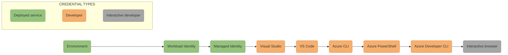

```mermaid
%% STEPS TO GENERATE IMAGE
%% =======================
%% 1. Install mermaid CLI (see https://github.com/mermaid-js/mermaid-cli/blob/master/README.md)
%%    v10.1.0 is known good for our process. npm install -g @mermaid-js/mermaid-cli@10.1.0
%% 2. Run command: mmdc -i DefaultAzureCredentialAuthFlow.md -o DefaultAzureCredentialAuthFlow.svg

flowchart LR;
    A(Environment):::deployed --> B(Workload Identity):::deployed --> C(Managed Identity):::deployed --> D(Visual Studio):::developer --> E(VS Code):::developer --> F(Azure CLI):::developer --> G(Azure PowerShell):::developer --> H(Azure Developer CLI):::developer --> I(Interactive browser):::interactive;

    subgraph CREDENTIAL TYPES;
        direction LR;
        Deployed(Deployed service):::deployed ~~~ Developer(Developer):::developer ~~~ Interactive(Interactive developer):::interactive;
    end;

    %% Define styles for credential type boxes
    classDef deployed fill:#95C37E, stroke:#71AD4C;
    classDef developer fill:#F5AF6F, stroke:#EB7C39;
    classDef interactive fill:#A5A5A5, stroke:#828282;

    %% Add API ref links to credential type boxes
    click A "https://learn.microsoft.com/dotnet/api/azure.identity.environmentcredential?view=azure-dotnet" _blank;
    click B "https://learn.microsoft.com/dotnet/api/azure.identity.workloadidentitycredential?view=azure-dotnet" _blank;
    click C "https://learn.microsoft.com/dotnet/api/azure.identity.managedidentitycredential?view=azure-dotnet" _blank;
    click D "https://learn.microsoft.com/dotnet/api/azure.identity.visualstudiocredential?view=azure-dotnet" _blank;
    click E "https://learn.microsoft.com/dotnet/api/azure.identity.visualstudiocodecredential?view=azure-dotnet" _blank;
    click F "https://learn.microsoft.com/dotnet/api/azure.identity.azureclicredential?view=azure-dotnet" _blank;
    click G "https://learn.microsoft.com/dotnet/api/azure.identity.azurepowershellcredential?view=azure-dotnet" _blank;
    click H "https://learn.microsoft.com/dotnet/api/azure.identity.azuredeveloperclicredential?view=azure-dotnet" _blank
    click I "https://learn.microsoft.com/dotnet/api/azure.identity.interactivebrowsercredential?view=azure-dotnet" _blank;
```
