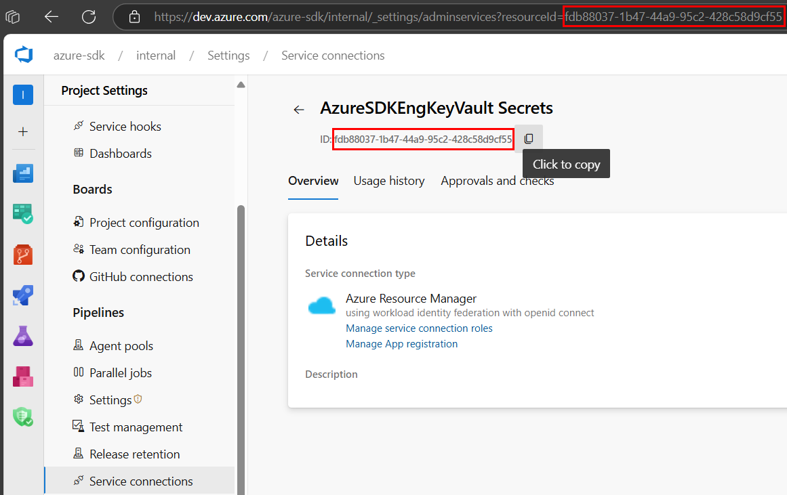

# Authenticating in Azure Pipelines with service connections

## Set up a federated identity credential in Azure Pipelines

To set up a federated identity credential (FIC) in Azure Pipelines, you can set up the Azure Resource Manager service connection as an [automatic recommended approach](https://learn.microsoft.com/azure/devops/pipelines/library/connect-to-azure?view=azure-devops#create-an-azure-resource-manager-service-connection-that-uses-workload-identity-federation).
You can also create it manually either using a [user-assigned managed identity to accept the ADO-issued token as a FIC](https://learn.microsoft.com/azure/devops/pipelines/release/configure-workload-identity?view=azure-devops#set-a-workload-identity-service-connection-to-use-managed-identity-authentication) or using an [App Registration to accept the Azure DevOps-issued token as a FIC](https://learn.microsoft.com/azure/devops/pipelines/release/configure-workload-identity?view=azure-devops#set-a-workload-identity-service-connection-to-use-service-principal-authentication).

Make sure you use one of the [recommended Azure Pipelines tasks][az_pipelines_tasks] so that FIC is available in Azure Pipelines.

To use `AzurePipelinesCredential`, configure the following values in the constructor:

1. `clientId`: Client ID from your user-assigned managed identity OR Application (client) ID from your app registration.
2. `tenantId`: Tenant ID from your user-assigned managed identity OR Directory (tenant) ID from your app registration.
3. `serviceConnectionId`: The service connection ID is the **GUID representing your service connection**. Once you navigate to an Azure Pipelines service connection details page, the value is obtained in one of the following ways:
    1. Copy the **ID:** value that appears below the service connection name.
    1. Copy the `resourceId` value from the querystring of the page's URL.
   
1. `systemAccessToken`: [See how to configure the predefined system variable System.AccessToken for the Azure Pipelines task](https://learn.microsoft.com/azure/devops/pipelines/build/variables?view=azure-devops&tabs=yaml#systemaccesstoken). This is the value you'll pass to the credential's constructor.

## Example of using an Azure Pipelines task

The following task YAML is an example of configuring the [AzureCLI@2](https://learn.microsoft.com/azure/devops/pipelines/tasks/reference/azure-cli-v2?view=azure-pipelines) task for using service connections federated identity with the Azure Identity library. See the list of [recommended Azure Pipelines tasks][az_pipelines_tasks].

```yml
trigger:
  - main

pool:
  vmImage: ubuntu-latest

steps:
  - task: AzureCLI@2
    displayName: "Azure CLI Task"
    env:
      SYSTEM_ACCESSTOKEN: $(System.AccessToken)
    inputs:
      azureSubscription: "<Name_of_AZURE_SERVICE_CONNECTION>"
      scriptType: bash
      scriptLocation: "inlineScript"
      inlineScript: |
        dotnet run <path-to-the-dotnet-application>
```

**Note: The environment variables `AZURESUBSCRIPTION_CLIENT_ID`, `AZURESUBSCRIPTION_TENANT_ID`, and `AZURESUBSCRIPTION_SERVICE_CONNECTION_ID` are configured by Azure Pipelines only in the tasks `AzureCLI@2` and [AzurePowerShell@5](https://learn.microsoft.com/azure/devops/pipelines/tasks/reference/azure-powershell-v5?view=azure-pipelines). Values from these environment variables should be passed into the constructor of `AzurePipelinesCredential` by the user.**

## Sample code for using AzurePipelinesCredential

This example demonstrates authenticating the Key Vault `SecretClient` using the `AzurePipelinesCredential` in an Azure Pipelines environment with [service connections](https://learn.microsoft.com/azure/devops/pipelines/library/service-endpoints).

In the below sample, it is recommended to assign the value of [$(System.AccessToken)](https://learn.microsoft.com/azure/devops/pipelines/build/variables?view=azure-devops&tabs=yaml#systemaccesstoken) to a secure variable in the Azure Pipelines environment.

```C# Snippet:AzurePipelinesCredential_Example
// Replace the following values with the actual values from the details for your service connection.
string clientId = "<the value of ClientId for the service connections>";
string tenantId = "<the value of TenantId for the service connections>";
string serviceConnectionId = "<the value of service connection Id>";

// Construct the credential.
var credential = new AzurePipelinesCredential(tenantId, clientId, serviceConnectionId, Environment.GetEnvironmentVariable("SYSTEM_ACCESSTOKEN"));

// Use the credential to authenticate with the Key Vault client.
var client = new SecretClient(new Uri("https://keyvault-name.vault.azure.net/"), credential);
```

***Note:*** This credential is **not** included in the `DefaultAzureCredential` chain.

# OnBehalfOfCredential with Managed Identity FIC Example

This example demonstrates the use of the `OnBehalfOfCredential` to authenticate the Key Vault `SecretClient` using a managed identity as the client assertion. More information about the On Behalf Of Flow can be found [here](https://learn.microsoft.com/entra/identity-platform/v2-oauth2-on-behalf-of-flow).

```C# Snippet:FederatedOboWithManagedIdentityCredential_Example
// Replace the following values with the actual values for your tenant and client ids.
string tenantId = "<tenant_id>";
string clientId = "<client_id>";

// Replace the following value with the actual user assertion.
string userAssertion = "<user_assertion>";

Func<CancellationToken, Task<string>> getManagedIdentityAssertion = async (cancellationToken) =>
{
    // Create a new instance of the ManagedIdentityCredential.
    var miCred = new ManagedIdentityCredential();

    // Get the token from the ManagedIdentityCredential using the token exchange scope.
    var result = await miCred.GetTokenAsync(new TokenRequestContext(new[] { "api://AzureADTokenExchange" }), cancellationToken: cancellationToken);

    // Return the token.
    return result.Token;
};

// Construct the credential.
var credential = new OnBehalfOfCredential(tenantId, clientId, getManagedIdentityAssertion, userAssertion);

// Use the credential to authenticate with the Key Vault client.
var client = new SecretClient(new Uri("https://keyvault-name.vault.azure.net/"), credential);
```

<!-- LINKS -->
[az_pipelines_tasks]: https://aka.ms/azdo-rm-workload-identity-tasks
