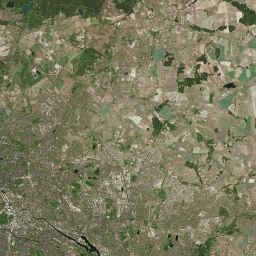
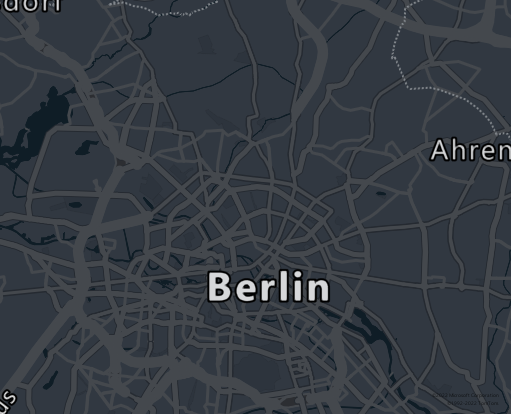
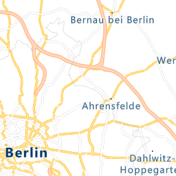

# Get secret

To use these samples, you'll first need to set up resources. See [getting started](https://github.com/Azure/azure-sdk-for-net/blob/main/sdk/template/Azure.Template/README.md#getting-started) for details.

## Render Tiles, Imageries, and Images

### Get correct tile index

Rendering map tiles requires the knowledge about [zoom levels and tile grid system](https://docs.microsoft.com/azure/azure-maps/zoom-levels-and-tile-grid). We provide very convenient APIs for user to find out the correct tile index and zoom level they need.

For example, if a user wants to render a tile in Germany with a specific bounding box range, one can import `Azure.Maps` namepace and use `PositionToTileXY` method from `TileMath`:

```C# Snippet:ImportTileMath
using Azure.Maps;
```

With the desired coordinate, zoom level and tile size, one can get tile X and Y index:

```C# Snippet:GetTileXY
int zoom = 10, tileSize = 300;

// Get tile X, Y index by coordinate, zoom and tile size information
TileMath.PositionToTileXY(
    new GeoPosition(13.3854, 52.517), zoom, tileSize,
    out var tileX, out var tileY
);
```

### Render imagery tiles

From previous section, we get the tile X, Y index we want, we amy continue to get the satellite imagery we need. First, import `System.IO` to use `File` class so we can save image to file:

```C# Snippet:SaveToFile
using System.IO;
```

Call get Map imagery tile API and save the result to file by previously calculated tile X, Y index:

```C# Snippet:RenderImagery
// Get imagery tile
var imageryTile = client.GetMapImageryTile(new TileIndex(tileX, tileY, zoom));
Assert.IsNotNull(imageryTile);

// Prepare a file stream to save the imagery
using (var fileStream = File.Create(".\\BerlinImagery.png"))
{
    imageryTile.Value.CopyTo(fileStream);
    Assert.IsNotNull(fileStream.Length > 0);
}
```

The imagery will look like:



### Render static images

To get static image, one can assign bounding box and zoom level or coordinate and image width and height with `RenderStaticImageOptions`:

```C# Snippet:RenderStaticImages
// Get static image
var staticImageOptions = new RenderStaticImageOptions()
{
    TileLayer = MapImageLayer.Basic,
    TileStyle = MapImageStyle.Dark,
    BoundingBox = new GeoBoundingBox(13.228,52.4559,13.5794,52.629),
    ZoomLevel = 10,
    RenderLanguage = "en",
};
var image = client.GetMapStaticImage(staticImageOptions);

// Prepare a file stream to save the imagery
using (var fileStream = File.Create(".\\BerlinStaticImage.png"))
{
    image.Value.CopyTo(fileStream);
    Assert.IsNotNull(fileStream.Length > 0);
}
```

The image will look like:



### Render tiles

To render map tiles, one can decide map tile X, Y index and zoom level and then decide the tile style in `RenderTileOptions`:

```C# Snippet:RenderMapTiles
int zoom = 10, tileSize = 300;

// Get tile X, Y index by coordinate, zoom and tile size information
TileMath.PositionToTileXY(
    new GeoPosition(13.3854, 52.517), zoom, tileSize,
    out var tileX, out var tileY
);

// Fetch map tiles
var renderTileOptions = new RenderTileOptions()
{
    TileFormat = TileFormat.Png,
    TileLayer = MapTileLayer.Hybrid,
    TileStyle = MapTileStyle.Main,
    TileIndex = new TileIndex(tileX, tileY, zoom),
};
var mapTile = client.GetMapTile(renderTileOptions);

// Prepare a file stream to save the imagery
using (var fileStream = File.Create(".\\BerlinMapTile.png"))
{
    mapTile.Value.CopyTo(fileStream);
    Assert.IsNotNull(fileStream.Length > 0);
}
```

The image will look like:


