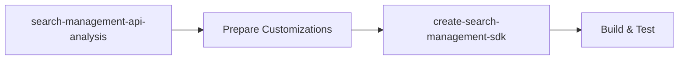

# Create Search Management SDK

Generate, build, and test `Azure.ResourceManager.Search` from Azure REST API specifications.

## Guidelines

1. **Never modify files outside `sdk/search/`** without explicit approval.
2. **Confirm SDK type first**: Management (`Azure.ResourceManager.Search`) vs Data plane (`Azure.Search.Documents`).
3. **Working directory**: Always run commands from `sdk/search/Azure.ResourceManager.Search/src/` unless specified otherwise.
4. **Run API analysis first**: Use `search-management-api-analysis` skill to identify breaking changes before generating. ALWAYS refer to `references/api-analysis.md` for understanding changes and required customizations. Make sure to use `search-management-api-analysis` skill to refresh the api-analysis.md if it is outdated or does not match the current spec commit or targets the wrong version.

## Related Skills

| Skill | When to Use |
|-------|-------------|
| [search-management-api-analysis]<!--(https://github.com/Azure/azure-sdk-for-net/blob/main/sdk/search/Azure.ResourceManager.Search/.github/skills/search-management-api-analysis/SKILL.md)--> | **Before generation** - Analyze spec changes, identify customizations needed |
| This skill | During generation - Generate, build, customize, test |

## Prerequisites

Before starting, ensure you have:

| Requirement | How to Check | Notes |
|-------------|--------------|-------|
| .NET SDK | `dotnet --version` | Requires .NET 10+ |
| PowerShell 7+ | `pwsh --version` | Required for scripts |
| Spec commit hash | Ask user, or it lives under references/api-analysis.md | From `azure-rest-api-specs` repo |
| Test proxy | `test-proxy --version` | Required for recorded tests |

**Always ask for the spec commit hash** before generating. Do not assume or use an old commit.

## Recommended Workflow

For best results, follow this order:



1. **Analyze** (search-management-api-analysis skill):
   - Fetch new spec from `azure-rest-api-specs`
   - Compare with current API version
   - Identify breaking changes and new features
   - Document suggested customizations

2. **Prepare** (manual):
   - Update `rename-mapping` in autorest.md. (NEVER update models that are not part of the api analysis report, unless explcitly directed.)
   - Create obsolete stubs for removed types
   - Add backward-compat factory methods

3. **Generate** (this skill):
   - Update commit hash and tag
   - Run code generation
   - Build and fix any remaining errors

4. **Validate**:
   - Export API surface
   - Run tests
   - Update CHANGELOG

## Key Files

| File | Purpose |
|------|---------|
| [src/autorest.md](https://github.com/Azure/azure-sdk-for-net/blob/main/sdk/search/Azure.ResourceManager.Search/src/autorest.md) | Generation config (require URL, rename-mapping). Only applicable to autorest SDK. |
| [src/Customization/](https://github.com/Azure/azure-sdk-for-net/blob/main/sdk/search/Azure.ResourceManager.Search/src/Customization/) | Hand-written partial classes |
| [src/Generated/](https://github.com/Azure/azure-sdk-for-net/blob/main/sdk/search/Azure.ResourceManager.Search/src/Generated/) | Auto-generated code (never edit directly) |
| [api/*.cs](https://github.com/Azure/azure-sdk-for-net/blob/main/sdk/search/Azure.ResourceManager.Search/api/) | Public API surface snapshots |
| [CHANGELOG.md](https://github.com/Azure/azure-sdk-for-net/blob/main/sdk/search/Azure.ResourceManager.Search/CHANGELOG.md) | Release notes |

## Step-by-Step Process

### Step 1: Update Spec Commit

Edit `src/autorest.md` and update the `require` URL with the new commit hash:

```yaml
require: https://github.com/Azure/azure-rest-api-specs/blob/<NEW_COMMIT_HASH>/specification/search/resource-manager/readme.md
```

Verify the commit exists: `https://github.com/Azure/azure-rest-api-specs/commit/<NEW_COMMIT_HASH>`

### Step 2: Generate Code

```powershell
cd sdk/search/Azure.ResourceManager.Search/src
dotnet build /t:GenerateCode
```

This regenerates all files in `src/Generated/`. Review the diff for unexpected changes.

### Step 3: Build and Fix Errors (Customizations)

```powershell
dotnet build
```
ALWAYS use `references/api-analysis.md` to understand what changed and what maybe need to potentially change.

**Common error types:**

| Error | Cause | Fix |
|-------|-------|-----|
| `CS0234` / `CS0246` | Missing type/namespace | Check rename-mapping in autorest.md |
| `MembersMustExist` | Breaking change (ApiCompat) | Add backward-compat shim in Customization/ |
| `TypesMustExist` | Type removed | Add obsolete stub in Customization/ |

**For breaking changes**, add customizations in `src/Customization/` (ONLY if dotnet build fails with ApiCompat errors). Do not modify generated code directly.:

### Step 4: Export API Surface

```powershell
pwsh eng/scripts/Export-API.ps1 search
```

This updates `api/*.cs` files. **CI will fail if this step is skipped.**

### Step 5: Update Snippets

```powershell
pwsh eng/scripts/Update-Snippets.ps1 search
```

Updates code snippets embedded in markdown documentation.

### Step 6: Format Code

```powershell
dotnet format sdk/search/Azure.ResourceManager.Search/src/Azure.ResourceManager.Search.csproj
dotnet format sdk/search/Azure.ResourceManager.Search/tests/Azure.ResourceManager.Search.Tests.csproj
```

### Step 7: Run Tests

```powershell
cd sdk/search/Azure.ResourceManager.Search
dotnet test --filter "TestCategory!=Live"
```

For live tests (requires Azure resources):
Prequisites(Ask user to provide):
- Ensure user is logged in to Azure CLI with `az login` (and using TME subscription)
- Azure Subscription ID with permissions to create resources
- Tenant ID
- Azure location for resource creation (e.g., `westus`)
- Resource Management URL (if different from public Azure or using canary). Two options:
  - `https://management.azure.com/` for public Azure
  - `https://eastus2euap.management.azure.com/` for canary environment
```powershell
$env:AZURE_TEST_MODE = "Live"
pwsh eng/common/TestResources/New-TestResources.ps1 -SubscriptionId <sub-id> -BaseName azssdktest -ResourceGroupName SDK_Test_01 -ServiceDirectory search -Location <azure-location> -EnvironmentVariables @{TENANT_ID="<tenant-id>";SEARCH_RESOURCE_MANAGER_URL="<resource-management-url>"}
dotnet test
```

### Step 8: Update CHANGELOG

Add entry in [CHANGELOG.md](https://github.com/Azure/azure-sdk-for-net/blob/main/sdk/search/Azure.ResourceManager.Search/CHANGELOG.md):

```markdown
## X.Y.Z (Unreleased)

### Features Added
- Upgraded API version to `YYYY-MM-DD`
```

## Quick Command Reference

| Task | Command |
|------|---------|
| Generate | `dotnet build /t:GenerateCode` |
| Build | `dotnet build` |
| Test (playback) | `dotnet test --filter "TestCategory!=Live"` |
| Export API | `pwsh eng/scripts/Export-API.ps1 search` |
| Update snippets | `pwsh eng/scripts/Update-Snippets.ps1 search` |
| Format | `dotnet format *.csproj` |
| Pack (validates ApiCompat) | `dotnet pack --no-restore` |

## Troubleshooting

### Generation produces no changes
- Verify the commit hash is correct and different from current
- Check if the spec tag in autorest.md matches the API version

### ApiCompat errors on build/pack
- These surface during `dotnet pack`, not `dotnet build`
- Add backward-compatible types in `src/Customization/`
- For intentional breaking changes in beta, update `ApiCompatVersion` in csproj

### Tests fail in playback mode
- Re-record tests: `$env:AZURE_TEST_MODE = "Record"; dotnet test`
- Check if session recordings exist in `tests/SessionRecords/`

### Rename-mapping not applied
- Verify YAML syntax in autorest.md
- Check if the type name matches the spec exactly
- Run with `mgmt-debug: show-serialized-names: true` to debug