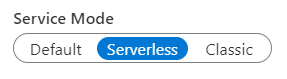

# Microsoft.Azure.SignalR.Serverless.Protocols

This project implements a protocol to communicate with Azure SignalR Service in serverless scenarios. It's recommended to use [Azure SignalR Function extension](https://github.com/Azure/azure-sdk-for-net/tree/main/sdk/signalr/Microsoft.Azure.WebJobs.Extensions.SignalRService/README.md) to handle serverless message, as it enables you to write codes in a more intuitive way. If you want to implement your own Web API server to handle serverless message, you could leverage this library to parse serverless messages.
## Getting started

### Install the package

Install the library with [NuGet](https://www.nuget.org/packages/Microsoft.Azure.SignalR.Serverless.Protocols/):

```dotnetcli
dotnet add package Microsoft.Azure.SignalR.Serverless.Protocols
```

### Prerequisites

- **Azure Subscription:**  To use Azure services, including Azure SignalR Service, you'll need a subscription.  If you do not have an existing Azure account, you may sign up for a [free trial](https://azure.microsoft.com/free/dotnet/) or use your [Visual Studio Subscription](https://visualstudio.microsoft.com/subscriptions/) benefits when you [create an account](https://account.windowsazure.com/Home/Index).

- **Azure SignalR resource:** To receive Azure SignalR serverless messages you'll also need a Azure SignalR resource. If you are not familiar with creating Azure resources, you may wish to follow the step-by-step guide for creating a SignalR resource using the Azure portal. There, you can also find detailed instructions for using the Azure CLI, Azure PowerShell, or Azure Resource Manager (ARM) templates to create a SignalR resource.

    To quickly create the needed SignalR resource in Azure and to receive a connection string for them, you can deploy our sample template by clicking:

    [](https://portal.azure.com/#create/Microsoft.Template/uri/https%3a%2f%2fraw.githubusercontent.com%2fAzure%2fazure-quickstart-templates%2fmaster%2fquickstarts%2fmicrosoft.signalrservice%2fsignalr%2fazuredeploy.json)

    After the instance is deployed, open it in the portal and locate its Settings page. Change the Service Mode setting to *Serverless*.

    

## Key concepts

### Upstream settings

Please see [doc](https://docs.microsoft.com/azure/azure-signalr/concept-upstream#serverless-protocols) here.

### JSON serverless protocol

Class `JsonServerlessProtocol` helps to parse serverless message with a HTTP header `Content-Type=application/json`. All the connection messages (including connected and disconnected events) should be parsed with JSON serverless protocol. Invocation messages should be parsed with JSON protocol when a HTTP header `Content-Type=application/json` is present.

### MessagePack serverless protocol

Class `MessagePackServerlessProtocol` helps to parse serverless **invocation message** with a HTTP header `Content-Type=application/x-msgpack`. Please note that connection messages won't be sent in MessagePack format.

## Examples

### Handle `OpenConnectionMessage`
This example demonstrates how to parse a `OpenConnectionMessage` from an `HttpRequest` and get useful information such as the connection ID and the user ID.

```C# Snippet:HandleConnectedMessage
public void HandleConnectedMessage(HttpRequest httpRequest, ILogger logger)
{
    var connectionId = httpRequest.Headers["X-ASRS-Connection-Id"];
    var userId = httpRequest.Headers["X-ASRS-User-Id"];

    using var memoryStream = new MemoryStream();
    httpRequest.Body.CopyTo(memoryStream);
    var bytes = new ReadOnlySequence<byte>(memoryStream.ToArray());
    var protocol = new JsonServerlessProtocol();
    if (protocol.TryParseMessage(ref bytes, out var message))
    {
        if (message is OpenConnectionMessage connectedMessage)
        {
            logger.LogInformation($"Connection {connectionId} is connected. User name is {userId}.");
        }
    }
}
```

### Handle `CloseConnectionMessage`
This example demonstrates how to parse a `CloseConnectionMessage` from an `HttpRequest` and get useful information such as the error why the connection is closed.

```C# Snippet:HandleDisconnectedMessage
public void HandleDisconnectedMessage(HttpRequest httpRequest, ILogger logger)
{
    var connectionId = httpRequest.Headers["X-ASRS-Connection-Id"];
    var userId = httpRequest.Headers["X-ASRS-User-Id"];

    using var memoryStream = new MemoryStream();
    httpRequest.Body.CopyTo(memoryStream);
    var bytes = new ReadOnlySequence<byte>(memoryStream.ToArray());
    var protocol = new JsonServerlessProtocol();
    if (protocol.TryParseMessage(ref bytes, out var message))
    {
        if (message is CloseConnectionMessage disconnectedMessage)
        {
            logger.LogInformation($"Connection {connectionId} is disconnected. User name is {userId}. Reason is {disconnectedMessage.Error}");
        }
    }
}
```
### Handle `InvocationMessage`
This example demonstrates how to parse a `InvocationMessage` from an `HttpRequest` according to its content-type header and get the invocation target and arguments.

```C# Snippet:HandleInvocationMessage
public async Task HandleInvocation(HttpRequest httpRequest, ILogger logger)
{
    var contentType = httpRequest.Headers["Content-Type"];
    IServerlessProtocol protocol = (string)contentType switch
    {
        "application/json" => new JsonServerlessProtocol(),
        "application/x-msgpack" => new MessagePackServerlessProtocol(),
        _ => throw new NotSupportedException(),
    };

    using var memoryStream = new MemoryStream();
    await httpRequest.Body.CopyToAsync(memoryStream);
    var bytes = new ReadOnlySequence<byte>(memoryStream.ToArray());
    if (protocol.TryParseMessage(ref bytes, out var message))
    {
        if (message is InvocationMessage invocationMessage)
        {
            var target = invocationMessage.Target;
            var arguments = invocationMessage.Arguments;
            logger.LogInformation($"{target},{arguments[0]}");
        }
    }
}

public Task Broadcast(object message)
{
    //do something here.
    return Task.CompletedTask;
}
```

