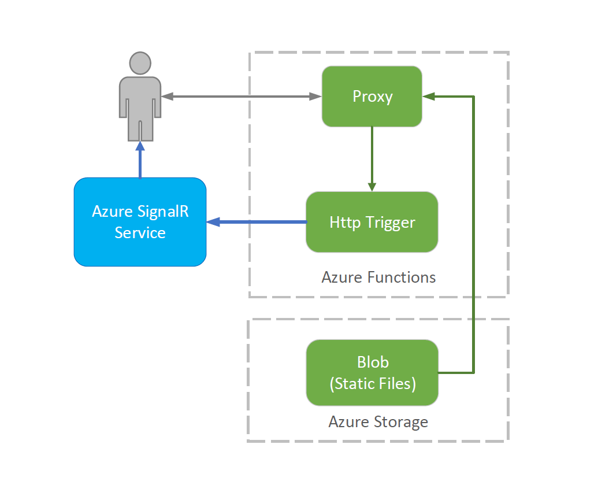
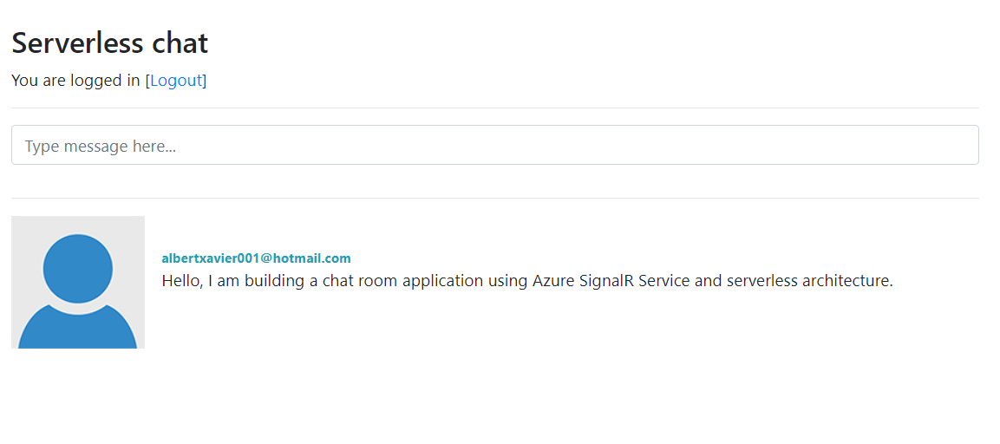

# Azure Function Chat Room Sample With Authentication

This sample application shows how to build a chat room application using Azure SignalR Service and serverless architecture. When you open the homepage of the application, you will login first and then you can chat with others.

A live demo can be found [here](<https://azure-signalr-serverless-auth-chatroom.azurewebsites.net/>).

## How Does It Work

The application is built on top of Azure SignalR Service, Functions and Storage. There is no web server needed in this sample.

Here is a diagram that illustrates the structure of this application:



1. When user opens the homepage and click Login link, it redirect you to a sign-in page. The supported authentication providers can be found [here](<https://docs.microsoft.com/en-us/azure/app-service/app-service-authentication-how-to#retrieve-tokens-in-app-code>).
2. Once you successfully sign-in, you will see a input box, you can broadcast messages to others. you can also click on a user to send a private message to this person by using Azure Functions and Azure SIgnalR Service.
3. The static content (homepage, scripts) are stored in Azure blob storage and exposed to user through Azure Function proxy.

## Deploy to Azure

### Deploy Static Files

1. Create resource group

   ```
   az group create --location <location> \
                   --name <resource_group>
   ```

2. Create storage account

   ```
   az storage account create \
   --location <location> \
   --name <account_name> \
   --resource-group <resource_group> \
   --sku Standard_LRS
   ```

3. Navigate to the ```samples\chat-with-auth\content``` folder and upload the static files

   Update your `samples\chat-with-auth\content\scripts\auth.js`.

   * Set `window.apiBaseUrl` to `https://<function_name>.azurewebsites.net`.

   ```
   az storage container create --account-name <account_name> --name content --public-access container
   az storage blob upload -c content --account-name <account_name> -n index.html -f index.html
   az storage blob upload -c content --account-name <account_name> -n scripts/auth.js -f scripts/auth.js
   ```

> Note: For simplicity, the script makes the blob container allows public read and list access to the entire container.

### Create a SignalR Service in Azure portal

[Create an Azure SignalR Service instance](<https://docs.microsoft.com/en-us/azure/azure-signalr/signalr-quickstart-azure-functions-csharp#create-an-azure-signalr-service-instance>).

### Deploy Azure Function

1. If you are using Visual Studio:

   1. Open `samples\chat-with-auth\csharp\FunctionApp\FunctionApp.sln`
   2. Right click `FunctionApp` in Solution Explorer and click `Publish...`. 
   3. Check `Create New`  and click `Publish` button.
   4. Login your Azure account and choose your function name, subscription, resource group, hosting plan, azure storage.
   5. Click `Create` button to create an Azure Function.
   6. Click `Edit Azure App Service Settings` to update application setting.
      1. Set `AzureSignalRConnectionString` to your SignalR service connection string.
      2. Set `BlobHost` to your storage host name.
   7. Click Publish button to deploy your function to Azure.

2. If you are using Azure CLI:
   1. Create Azure function

   ```
   az functionapp create --resource-group <resource_group_name> --name <function_name> \
   --consumption-plan-location <plan_name> --storage-account <storage_account_name>
   ```

    > Note: Please provide a unique name for ```function_name```

3. Navigate to the ```samples\chat-with-auth\csharp\FunctionApp``` folder and configure the deployment credentials

   ```
   az functionapp deployment source config-local-git --resource-group <resource_group_name> --name <function_name>
   az functionapp deployment user set --user-name <user_name> --password <password>
   ```

   > Note:  Please take note of the Git url returned as you will need it later on.

4. Build and deploy Azure function

   Navigate to `samples\chat-with-auth\csharp\FunctionApp`.

   ```
   dotnet restore
   dotnet build --configuration Release
   
   cd bin/Release/netstandard2.0
   git init
   git remote add origin <deploy_git_url>
   git add -A
   git commit -m "init commit"
   git push origin master
   ```

5. Update application settings

   ```
   az functionapp config appsettings set --resource-group <resource_group_name> --name <function_name> \
      --setting BlobHost=<blob_host>
   az functionapp config appsettings set --resource-group <resource_group_name> --name <function_name> \
      --setting AzureSignalRConnectionString=<signalr_connection_string>
   az functionapp config appsettings set --resource-group <resource_group_name> --name <function_name> \
      --setting FUNCTIONS_EXTENSION_VERSION=~2 
   ```

> Note:  ```blob_host``` is the blob service endpoint hostname (without https://), which you can find in the Blob Service Containers section. ```signalr_connection_string``` refers to the connection string you used before in the Chatroom sample.

## Conifigure Authentication

1. In Azure portal, navigate to `Settings`
2. In `Authentication (classic)`, click button `On`.
3. Change `Action to take when request is not authenticated` list to `Log in with Azure Active Directory`.
4. Configure AAD in `Azure Active Directory Settings`.
5. Finally, click `Save`.

You can also switch to other authentication providers, The supported authentication providers can be found [here](<https://docs.microsoft.com/en-us/azure/app-service/app-service-authentication-how-to#retrieve-tokens-in-app-code>). Make sure you update the `Window.authProvider` in  `samples\chat-with-auth\content\scripts\auth.js` and the `IdToken` in `Functions.cs`.

## Run the application

Go to the url that was deployed as part of your Function App:

   ```
   https://<function_name>.azurewebsites.net/
   ```

Once you login, it should show you an output similar to this:

