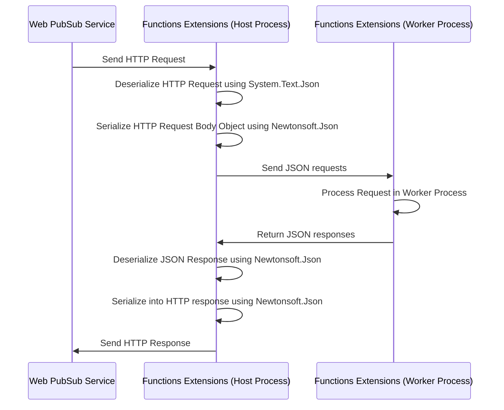

# Contribution Hints

This file provides some hints for contributing to the Microsoft.Azure.WebPubSub.Common library.

## JSON serialization and deserialization

The main purpose of this project is to provide classes for JSON serialization and deserialization to the Azure Functions extensions and the `AspNetCore` project.

Currently all the classes for CloudEvents requests have customized JSON converters or customized deserialization classes. This is because in .NET framework, `System.Text.Json` cannot support deserialization of classes without a pameterless constructor. Therefore we need to customize the deserialization of these classes.